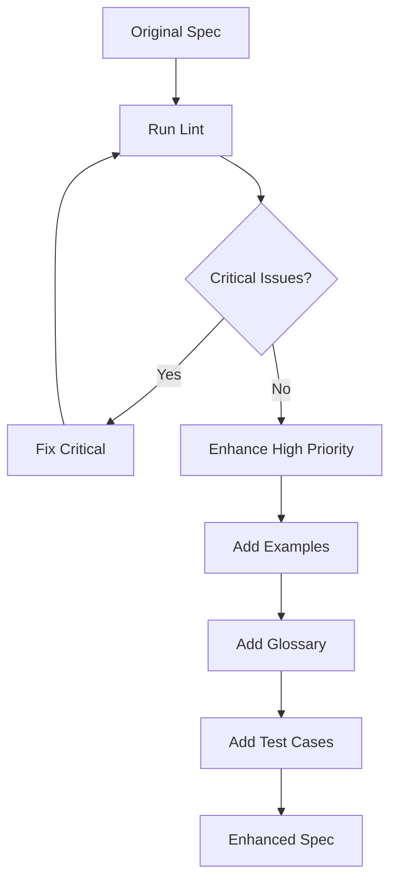
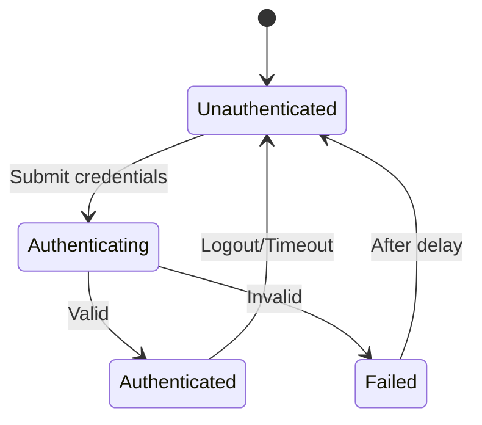

# Specification Enhancer

Automatically improves your specification based on lint results and best practices.

## Usage

```bash
/spec-enhance                      # Enhance current scope
/spec-enhance --focus clarity      # Focus on specific dimension
/spec-enhance --interactive        # Step-by-step enhancement
/spec-enhance --target-score 8.5   # Enhance until target score reached
```

## Enhancement Areas

### 1. **Clarity Improvements**
- Replace vague terms with precise definitions
- Add mathematical formulas for calculations
- Include concrete examples
- Specify units and formats

### 2. **Completeness Additions**
- Add missing edge cases
- Include error scenarios
- Define integration points
- Specify data validation rules

### 3. **Consistency Fixes**
- Standardize terminology
- Align data models
- Resolve contradictions
- Unify naming conventions

### 4. **Testability Enhancements**
- Add measurable success criteria
- Include test scenarios
- Define test data requirements
- Specify assertion conditions

### 5. **Implementation Details**
- Add algorithm pseudocode
- Include data structures
- Specify API contracts
- Define performance benchmarks

## Enhancement Process



## Example Enhancements

### Before Enhancement
```yaml
slice:
  title: "User Login"
  description: "Users can log in"
  acceptance_criteria:
    - "Login works"
    - "Shows errors"
```

### After Enhancement
```yaml
slice:
  title: "User Login with Email/Password"
  description: "Authenticated users can access the system using email and password credentials"
  
  acceptance_criteria:
    - "User can enter email (RFC 5322 compliant) and password (8-128 chars)"
    - "System validates credentials against bcrypt-hashed password in database"
    - "Success: Return JWT token (expires in 30 min) and redirect to dashboard"
    - "Failure: Return specific error (invalid email/wrong password/account locked)"
    - "Rate limiting: Max 5 attempts per IP per 15 minutes"
    
  technical_requirements:
    validation:
      email: "RFC 5322 regex: ^[a-zA-Z0-9._%+-]+@[a-zA-Z0-9.-]+\.[a-zA-Z]{2,}$"
      password: "Length 8-128, at least 1 uppercase, 1 lowercase, 1 number"
    
    security:
      - "Passwords hashed with bcrypt (cost factor 12)"
      - "JWT signed with RS256"
      - "Refresh tokens stored in httpOnly cookies"
      - "CSRF token required for state-changing operations"
    
    performance:
      - "Authentication check: < 100ms P95"
      - "Token generation: < 50ms P95"
      - "Database query: Use index on email field"
    
    error_handling:
      invalid_email: 
        code: "AUTH_001"
        message: "Email format is invalid"
        http_status: 400
      
      wrong_password:
        code: "AUTH_002"
        message: "Invalid credentials"
        http_status: 401
        note: "Same message as unknown email for security"
      
      account_locked:
        code: "AUTH_003"
        message: "Account temporarily locked"
        http_status: 429
        retry_after: 900  # seconds
    
    examples:
      success:
        request:
          email: "user@example.com"
          password: "SecurePass123!"
        response:
          token: "eyJhbGciOiJSUzI1NiIs..."
          expires_in: 1800
          refresh_token: "uuid-v4-token"
      
      failure:
        request:
          email: "user@example.com"
          password: "wrong"
        response:
          error: "AUTH_002"
          message: "Invalid credentials"
    
    test_scenarios:
      - "Valid credentials → Success"
      - "Invalid email format → AUTH_001"
      - "Wrong password → AUTH_002"
      - "5+ attempts → AUTH_003"
      - "SQL injection attempt → Blocked"
      - "XSS in email field → Sanitized"
```

## Auto-Generated Additions

### Glossary Section
```yaml
glossary:
  jwt_token:
    definition: "JSON Web Token for stateless authentication"
    structure: "header.payload.signature"
    algorithm: "RS256"
    expiry: "30 minutes from issue"
  
  rate_limiting:
    definition: "Throttling mechanism to prevent abuse"
    implementation: "Sliding window counter"
    storage: "Redis with TTL"
```

### Decision Log
```yaml
decisions:
  - question: "Session duration?"
    options: ["15 min", "30 min", "1 hour"]
    decision: "30 min"
    rationale: "Balance between security and UX"
  
  - question: "Password hashing algorithm?"
    options: ["bcrypt", "scrypt", "argon2"]
    decision: "bcrypt"
    rationale: "Mature, well-tested, widely supported"
```

### State Diagrams


### Test Cases
```yaml
test_cases:
  happy_path:
    - name: "Successful login"
      input: {email: "test@example.com", password: "Valid123!"}
      expected: {status: 200, has_token: true}
  
  edge_cases:
    - name: "Email with +"
      input: {email: "test+tag@example.com", password: "Valid123!"}
      expected: {status: 200}
    
    - name: "Maximum password length"
      input: {email: "test@example.com", password: "a" * 128}
      expected: {status: 200}
  
  error_cases:
    - name: "SQL injection"
      input: {email: "' OR '1'='1", password: "any"}
      expected: {status: 400, error: "AUTH_001"}
```

## Quality Metrics

| Metric | Before | After | Improvement |
|--------|--------|-------|-------------|
| Clarity Score | 5.0 | 9.0 | +80% |
| Completeness | 4.0 | 8.5 | +112% |
| Testability | 3.0 | 9.5 | +216% |
| **Overall** | **4.5** | **8.8** | **+95%** |

## Best Practices

1. **Iterative Enhancement**: Run multiple times for best results
2. **Focus Areas**: Target specific weaknesses first
3. **Review Changes**: Verify enhancements match intent
4. **Preserve Context**: Don't lose business requirements
5. **Add Examples**: Every complex rule needs an example
6. **Test Everything**: Enhanced specs should be more testable
7. **Document Decisions**: Record why choices were made