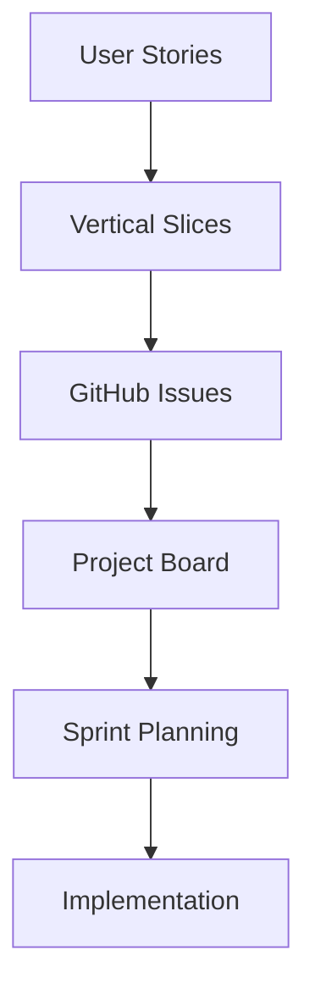

# Stories to GitHub Integration

Seamlessly convert user stories into GitHub issues, organize them into project boards, and create vertical slices for implementation.

## Usage

```bash
# Convert all user stories to GitHub issues
/stories-to-github user-stories/*.md

# Convert specific stories
/stories-to-github US-001 US-002 US-003

# Create with project board
/stories-to-github --create-project "Sprint 1" US-001..US-005

# Link to existing project
/stories-to-github --project-id 123 US-006..US-010
```

## The Complete Flow



## Step 1: User Stories → Vertical Slices

A vertical slice groups related user stories that should be implemented together:

```yaml
# slices/VS-001-event-detection.yaml
slice:
  id: VS-001
  name: Event Detection System
  description: Core event detection and display functionality
  
  stories:
    - id: US-001
      title: View Resistance Events
      points: 5
    - id: US-002
      title: Calculate Event Features
      points: 8
    - id: US-003
      title: Export Event Data
      points: 3
  
  components:
    database:
      - events_table schema
      - indexes for performance
    backend:
      - Event detection algorithm
      - Feature calculation service
      - Export API endpoint
    frontend:
      - Events table component
      - Export button
      - Loading states
  
  dependencies:
    - Market data connection (VS-000)
  
  estimated_days: 5
  priority: P0
```

## Step 2: Vertical Slices → GitHub Issues

Each slice becomes multiple GitHub issues:

```markdown
# GitHub Issue: Backend - Event Detection (VS-001)

## Overview
Part of VS-001: Event Detection System

## User Stories Included
- [ ] US-001: View Resistance Events
- [ ] US-002: Calculate Event Features

## Technical Requirements
- Implement event detection algorithm
- Create feature calculation service
- Add database migrations

## Acceptance Criteria
- [ ] Events detected within 1 second
- [ ] Features calculated accurately
- [ ] API returns data in correct format

## Links
- Vertical Slice: VS-001
- Project: [Sprint 1 Board](link)
- Dependencies: #45 (Market Data)

Labels: backend, vertical-slice, sprint-1
Assignee: @backend-team
Milestone: v1.0
```

## Step 3: GitHub Issues → Project Board

Create organized project boards:

```bash
# Using GitHub CLI
gh project create "Sprint 1" --owner @me --visibility public

# Add columns
gh project field-create 1 --owner @me --name "Status" \
  --data-type "SINGLE_SELECT" \
  --single-select-options "Todo,In Progress,Review,Done"

# Add issues to project
gh project item-add 1 --owner @me --url https://github.com/user/repo/issues/1
```

## Automated Workflow

### 1. Parse User Stories
```javascript
function parseUserStory(file) {
  return {
    id: extractId(file),
    title: extractTitle(file),
    acceptanceCriteria: extractCriteria(file),
    points: extractPoints(file),
    priority: extractPriority(file)
  };
}
```

### 2. Group into Slices
```javascript
function createVerticalSlices(stories) {
  // Group by feature area
  const slices = {};
  
  stories.forEach(story => {
    const area = detectFeatureArea(story);
    if (!slices[area]) {
      slices[area] = {
        id: generateSliceId(),
        stories: [],
        components: detectComponents(story)
      };
    }
    slices[area].stories.push(story);
  });
  
  return slices;
}
```

### 3. Create GitHub Issues
```bash
# For each slice, create issues
for slice in slices/*; do
  # Create backend issue
  gh issue create \
    --title "[VS-001] Backend: Event Detection" \
    --body "$(generate_backend_issue $slice)" \
    --label "backend,vertical-slice" \
    --milestone "v1.0"
  
  # Create frontend issue  
  gh issue create \
    --title "[VS-001] Frontend: Event Display" \
    --body "$(generate_frontend_issue $slice)" \
    --label "frontend,vertical-slice" \
    --milestone "v1.0"
  
  # Create database issue
  gh issue create \
    --title "[VS-001] Database: Event Schema" \
    --body "$(generate_db_issue $slice)" \
    --label "database,vertical-slice" \
    --milestone "v1.0"
done
```

### 4. Link to Project Board
```bash
# Get project ID
PROJECT_ID=$(gh project list --owner @me --format json | jq '.[] | select(.title=="Sprint 1") | .id')

# Add all issues to project
gh issue list --label "sprint-1" --json number --jq '.[].number' | while read issue; do
  gh project item-add $PROJECT_ID --owner @me --url "https://github.com/$REPO/issues/$issue"
done
```

## GitHub Project Board Structure

```
┌─────────────────────────────────────────────────────────┐
│                     Sprint 1 Board                      │
├──────────┬──────────┬──────────┬──────────┬───────────┤
│  Backlog │   Todo   │ In Prog  │  Review  │   Done    │
├──────────┼──────────┼──────────┼──────────┼───────────┤
│ VS-002   │ VS-001-B │ VS-001-F │          │           │
│ VS-003   │ VS-001-D │          │          │           │
│ VS-004   │          │          │          │           │
└──────────┴──────────┴──────────┴──────────┴───────────┘

VS-001-B: Backend for VS-001
VS-001-F: Frontend for VS-001
VS-001-D: Database for VS-001
```

## Issue Templates

### Backend Issue Template
```markdown
## 🎯 Objective
[Slice objective]

## 📋 User Stories
- [ ] US-XXX: [Title] (X points)

## 🔧 Technical Tasks
- [ ] Implement [algorithm/service]
- [ ] Add unit tests
- [ ] Add integration tests
- [ ] Update API documentation

## ✅ Definition of Done
- [ ] Code reviewed
- [ ] Tests passing
- [ ] Documentation updated
- [ ] Deployed to staging
```

### Frontend Issue Template
```markdown
## 🎯 Objective
[Slice objective]

## 📋 User Stories
- [ ] US-XXX: [Title] (X points)

## 🎨 UI Components
- [ ] Create [component]
- [ ] Add loading states
- [ ] Add error handling
- [ ] Implement responsive design

## ✅ Definition of Done
- [ ] Pixel-perfect with design
- [ ] Accessibility checked
- [ ] Cross-browser tested
- [ ] Performance optimized
```

## Tracking & Reporting

### Velocity Tracking
```javascript
// Track story points completed per sprint
const velocity = {
  sprint1: { planned: 45, completed: 42 },
  sprint2: { planned: 50, completed: 48 },
  averageVelocity: 45
};
```

### Burndown Chart
```
Story Points
50 |*
45 |  *
40 |    *
35 |      *
30 |        *
25 |          *
20 |            *
15 |              *
10 |                *
5  |                  *
0  |____________________*
   Mon  Tue  Wed  Thu  Fri
```

## Commands

### Individual Commands
```bash
/create-slice US-001 US-002        # Group stories into slice
/slice-to-issues VS-001            # Create GitHub issues from slice
/add-to-project VS-001 "Sprint 1"  # Add to project board
/update-issue-status #45 "In Progress"
```

### Batch Operations
```bash
/batch-create-issues slices/*.yaml
/batch-update-project "Sprint 1" VS-001..VS-005
/generate-sprint-report "Sprint 1"
```

## Integration with CI/CD

### Auto-update on PR
```yaml
# .github/workflows/update-project.yml
name: Update Project Board
on:
  pull_request:
    types: [opened, closed]

jobs:
  update:
    runs-on: ubuntu-latest
    steps:
      - name: Move issue to In Progress
        if: github.event.action == 'opened'
        run: |
          gh project item-edit --id $ITEM_ID --field-id $STATUS_FIELD --project-id $PROJECT_ID --single-select-option-id "In Progress"
      
      - name: Move issue to Done
        if: github.event.pull_request.merged == true
        run: |
          gh project item-edit --id $ITEM_ID --field-id $STATUS_FIELD --project-id $PROJECT_ID --single-select-option-id "Done"
```

## Best Practices

1. **One slice = One deliverable feature**
2. **Include all layers** (DB, API, UI) in each slice
3. **Keep slices small** (3-5 days max)
4. **Link everything** (stories → slices → issues → PRs)
5. **Update status automatically** via GitHub Actions

## Example: Complete Flow

```bash
# 1. Start with user stories
/spec-to-stories "Build event detection system"
# Output: US-001 through US-005

# 2. Group into vertical slice
/create-slice US-001 US-002 US-003 --name "Event Detection Core"
# Output: VS-001

# 3. Generate GitHub issues
/slice-to-issues VS-001
# Output: Issues #45, #46, #47 created

# 4. Create sprint project
/create-sprint "Sprint 1" VS-001
# Output: Project board created with issues

# 5. Start development
/issue #45
/backend Implement event detection algorithm
```

## Status Tracking

```bash
# Check slice status
/slice-status VS-001
```

Output:
```
VS-001: Event Detection Core
Progress: 60% (3/5 stories complete)

Issues:
✅ #45 Backend: Event Detection (Done)
🔄 #46 Frontend: Event Display (In Progress)
⏳ #47 Database: Event Schema (Todo)

Stories:
✅ US-001: View Resistance Events
✅ US-002: Calculate Event Features
🔄 US-003: Export Event Data
```

This creates a complete, traceable path from specification to implementation!