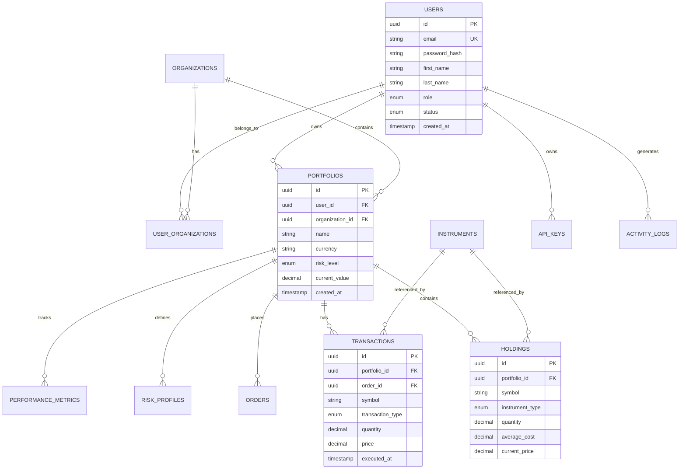

# Database Schema Documentation

## Overview

This document provides comprehensive documentation of the QuantX Platform database schema, including entity relationships, data types, constraints, and indexing strategies. The platform uses a multi-database approach with PostgreSQL as the primary transactional database, InfluxDB for time series data, and additional specialized stores.

## Database Architecture

### Database Distribution Strategy

```
┌─────────────────┐  ┌─────────────────┐  ┌─────────────────┐
│   PostgreSQL    │  │    InfluxDB     │  │   Elasticsearch │
│   (Primary)     │  │  (Time Series)  │  │    (Search)     │
│                 │  │                 │  │                 │
│ • Users         │  │ • Market Data   │  │ • Search Index  │
│ • Portfolios    │  │ • Price History │  │ • Document Store│
│ • Transactions  │  │ • Metrics       │  │ • Full Text     │
│ • Orders        │  │ • Events        │  │                 │
│ • Settings      │  │                 │  │                 │
└─────────────────┘  └─────────────────┘  └─────────────────┘
        │                     │                     │
        └─────────────────────┼─────────────────────┘
                              │
┌─────────────────┐  ┌─────────────────┐  ┌─────────────────┐
│     Redis       │  │    S3/MinIO     │  │   Message Queue │
│   (Cache)       │  │  (Object Store) │  │   (Events)      │
│                 │  │                 │  │                 │
│ • Sessions      │  │ • Reports       │  │ • Trade Events  │
│ • Cache Data    │  │ • Documents     │  │ • Risk Alerts   │
│ • Rate Limits   │  │ • Backups       │  │ • Notifications │
│ • Pub/Sub       │  │ • Logs          │  │ • Processing    │
└─────────────────┘  └─────────────────┘  └─────────────────┘
```

## PostgreSQL Schema

### Core Entities

#### Users Table

```sql
CREATE TABLE users (
    id UUID PRIMARY KEY DEFAULT gen_random_uuid(),
    email VARCHAR(255) UNIQUE NOT NULL,
    password_hash VARCHAR(255) NOT NULL,
    first_name VARCHAR(100),
    last_name VARCHAR(100),
    phone VARCHAR(20),
    role user_role_enum NOT NULL DEFAULT 'USER',
    status user_status_enum NOT NULL DEFAULT 'ACTIVE',
    email_verified BOOLEAN DEFAULT FALSE,
    phone_verified BOOLEAN DEFAULT FALSE,
    two_factor_enabled BOOLEAN DEFAULT FALSE,
    two_factor_secret VARCHAR(255),
    last_login_at TIMESTAMP WITH TIME ZONE,
    password_reset_token VARCHAR(255),
    password_reset_expires_at TIMESTAMP WITH TIME ZONE,
    email_verification_token VARCHAR(255),
    email_verification_expires_at TIMESTAMP WITH TIME ZONE,
    created_at TIMESTAMP WITH TIME ZONE DEFAULT NOW(),
    updated_at TIMESTAMP WITH TIME ZONE DEFAULT NOW(),
    deleted_at TIMESTAMP WITH TIME ZONE
);

-- Enums
CREATE TYPE user_role_enum AS ENUM ('ADMIN', 'TRADER', 'ANALYST', 'USER');
CREATE TYPE user_status_enum AS ENUM ('ACTIVE', 'SUSPENDED', 'PENDING', 'DEACTIVATED');

-- Indexes
CREATE INDEX idx_users_email ON users(email);
CREATE INDEX idx_users_role ON users(role);
CREATE INDEX idx_users_status ON users(status);
CREATE INDEX idx_users_created_at ON users(created_at);
```

#### Organizations Table

```sql
CREATE TABLE organizations (
    id UUID PRIMARY KEY DEFAULT gen_random_uuid(),
    name VARCHAR(255) NOT NULL,
    slug VARCHAR(100) UNIQUE NOT NULL,
    description TEXT,
    website VARCHAR(255),
    plan organization_plan_enum NOT NULL DEFAULT 'FREE',
    status organization_status_enum NOT NULL DEFAULT 'ACTIVE',
    settings JSONB DEFAULT '{}',
    created_at TIMESTAMP WITH TIME ZONE DEFAULT NOW(),
    updated_at TIMESTAMP WITH TIME ZONE DEFAULT NOW()
);

CREATE TYPE organization_plan_enum AS ENUM ('FREE', 'PRO', 'ENTERPRISE');
CREATE TYPE organization_status_enum AS ENUM ('ACTIVE', 'SUSPENDED', 'TRIAL');

-- User-Organization Relationship
CREATE TABLE user_organizations (
    id UUID PRIMARY KEY DEFAULT gen_random_uuid(),
    user_id UUID NOT NULL REFERENCES users(id) ON DELETE CASCADE,
    organization_id UUID NOT NULL REFERENCES organizations(id) ON DELETE CASCADE,
    role org_role_enum NOT NULL DEFAULT 'MEMBER',
    permissions TEXT[] DEFAULT '{}',
    joined_at TIMESTAMP WITH TIME ZONE DEFAULT NOW(),
    UNIQUE(user_id, organization_id)
);

CREATE TYPE org_role_enum AS ENUM ('OWNER', 'ADMIN', 'MANAGER', 'MEMBER');
```

#### Portfolios Table

```sql
CREATE TABLE portfolios (
    id UUID PRIMARY KEY DEFAULT gen_random_uuid(),
    user_id UUID NOT NULL REFERENCES users(id) ON DELETE CASCADE,
    organization_id UUID REFERENCES organizations(id) ON DELETE CASCADE,
    name VARCHAR(255) NOT NULL,
    description TEXT,
    currency VARCHAR(3) NOT NULL DEFAULT 'USD',
    risk_level risk_level_enum NOT NULL DEFAULT 'MODERATE',
    strategy_type strategy_type_enum,
    benchmark_symbol VARCHAR(20),
    initial_balance DECIMAL(15,2) NOT NULL DEFAULT 0,
    current_value DECIMAL(15,2) DEFAULT 0,
    unrealized_pnl DECIMAL(15,2) DEFAULT 0,
    realized_pnl DECIMAL(15,2) DEFAULT 0,
    cash_balance DECIMAL(15,2) DEFAULT 0,
    settings JSONB DEFAULT '{}',
    is_active BOOLEAN DEFAULT TRUE,
    created_at TIMESTAMP WITH TIME ZONE DEFAULT NOW(),
    updated_at TIMESTAMP WITH TIME ZONE DEFAULT NOW(),
    
    CONSTRAINT chk_positive_balance CHECK (initial_balance >= 0)
);

CREATE TYPE risk_level_enum AS ENUM ('CONSERVATIVE', 'MODERATE', 'AGGRESSIVE', 'SPECULATIVE');
CREATE TYPE strategy_type_enum AS ENUM ('BUY_HOLD', 'VALUE', 'GROWTH', 'MOMENTUM', 'ARBITRAGE', 'CUSTOM');

-- Indexes
CREATE INDEX idx_portfolios_user_id ON portfolios(user_id);
CREATE INDEX idx_portfolios_organization_id ON portfolios(organization_id);
CREATE INDEX idx_portfolios_strategy_type ON portfolios(strategy_type);
CREATE INDEX idx_portfolios_created_at ON portfolios(created_at);
```

#### Holdings Table

```sql
CREATE TABLE holdings (
    id UUID PRIMARY KEY DEFAULT gen_random_uuid(),
    portfolio_id UUID NOT NULL REFERENCES portfolios(id) ON DELETE CASCADE,
    symbol VARCHAR(20) NOT NULL,
    instrument_type instrument_type_enum NOT NULL,
    quantity DECIMAL(18,8) NOT NULL,
    average_cost DECIMAL(15,4) NOT NULL,
    current_price DECIMAL(15,4),
    market_value DECIMAL(15,2),
    unrealized_pnl DECIMAL(15,2),
    cost_basis DECIMAL(15,2),
    last_updated TIMESTAMP WITH TIME ZONE DEFAULT NOW(),
    created_at TIMESTAMP WITH TIME ZONE DEFAULT NOW(),
    
    CONSTRAINT chk_quantity_not_zero CHECK (quantity != 0),
    UNIQUE(portfolio_id, symbol)
);

CREATE TYPE instrument_type_enum AS ENUM ('STOCK', 'BOND', 'ETF', 'OPTION', 'FUTURE', 'FOREX', 'CRYPTO', 'COMMODITY');

-- Indexes
CREATE INDEX idx_holdings_portfolio_id ON holdings(portfolio_id);
CREATE INDEX idx_holdings_symbol ON holdings(symbol);
CREATE INDEX idx_holdings_instrument_type ON holdings(instrument_type);
```

#### Transactions Table

```sql
CREATE TABLE transactions (
    id UUID PRIMARY KEY DEFAULT gen_random_uuid(),
    portfolio_id UUID NOT NULL REFERENCES portfolios(id) ON DELETE CASCADE,
    order_id UUID REFERENCES orders(id),
    symbol VARCHAR(20) NOT NULL,
    transaction_type transaction_type_enum NOT NULL,
    quantity DECIMAL(18,8) NOT NULL,
    price DECIMAL(15,4) NOT NULL,
    fees DECIMAL(15,2) DEFAULT 0,
    total_amount DECIMAL(15,2) NOT NULL,
    currency VARCHAR(3) DEFAULT 'USD',
    executed_at TIMESTAMP WITH TIME ZONE NOT NULL,
    settlement_date DATE,
    notes TEXT,
    metadata JSONB DEFAULT '{}',
    created_at TIMESTAMP WITH TIME ZONE DEFAULT NOW(),
    
    CONSTRAINT chk_quantity_positive CHECK (quantity > 0),
    CONSTRAINT chk_price_positive CHECK (price > 0)
);

CREATE TYPE transaction_type_enum AS ENUM ('BUY', 'SELL', 'DIVIDEND', 'SPLIT', 'MERGER', 'SPINOFF', 'DEPOSIT', 'WITHDRAWAL');

-- Indexes
CREATE INDEX idx_transactions_portfolio_id ON transactions(portfolio_id);
CREATE INDEX idx_transactions_symbol ON transactions(symbol);
CREATE INDEX idx_transactions_executed_at ON transactions(executed_at);
CREATE INDEX idx_transactions_type ON transactions(transaction_type);
```

#### Orders Table

```sql
CREATE TABLE orders (
    id UUID PRIMARY KEY DEFAULT gen_random_uuid(),
    portfolio_id UUID NOT NULL REFERENCES portfolios(id) ON DELETE CASCADE,
    user_id UUID NOT NULL REFERENCES users(id),
    symbol VARCHAR(20) NOT NULL,
    order_type order_type_enum NOT NULL,
    side order_side_enum NOT NULL,
    quantity DECIMAL(18,8) NOT NULL,
    price DECIMAL(15,4),
    stop_price DECIMAL(15,4),
    time_in_force tif_enum NOT NULL DEFAULT 'DAY',
    status order_status_enum NOT NULL DEFAULT 'PENDING',
    filled_quantity DECIMAL(18,8) DEFAULT 0,
    average_fill_price DECIMAL(15,4),
    broker_order_id VARCHAR(100),
    broker VARCHAR(50),
    fees DECIMAL(15,2) DEFAULT 0,
    commission DECIMAL(15,2) DEFAULT 0,
    error_message TEXT,
    placed_at TIMESTAMP WITH TIME ZONE DEFAULT NOW(),
    filled_at TIMESTAMP WITH TIME ZONE,
    canceled_at TIMESTAMP WITH TIME ZONE,
    expires_at TIMESTAMP WITH TIME ZONE,
    metadata JSONB DEFAULT '{}',
    created_at TIMESTAMP WITH TIME ZONE DEFAULT NOW(),
    updated_at TIMESTAMP WITH TIME ZONE DEFAULT NOW(),
    
    CONSTRAINT chk_quantity_positive CHECK (quantity > 0),
    CONSTRAINT chk_filled_quantity_valid CHECK (filled_quantity >= 0 AND filled_quantity <= quantity)
);

CREATE TYPE order_type_enum AS ENUM ('MARKET', 'LIMIT', 'STOP', 'STOP_LIMIT', 'TRAILING_STOP');
CREATE TYPE order_side_enum AS ENUM ('BUY', 'SELL');
CREATE TYPE tif_enum AS ENUM ('DAY', 'GTC', 'IOC', 'FOK');
CREATE TYPE order_status_enum AS ENUM ('PENDING', 'SUBMITTED', 'PARTIAL_FILL', 'FILLED', 'CANCELED', 'REJECTED', 'EXPIRED');

-- Indexes
CREATE INDEX idx_orders_portfolio_id ON orders(portfolio_id);
CREATE INDEX idx_orders_user_id ON orders(user_id);
CREATE INDEX idx_orders_symbol ON orders(symbol);
CREATE INDEX idx_orders_status ON orders(status);
CREATE INDEX idx_orders_placed_at ON orders(placed_at);
```

#### Instruments Table

```sql
CREATE TABLE instruments (
    id UUID PRIMARY KEY DEFAULT gen_random_uuid(),
    symbol VARCHAR(20) UNIQUE NOT NULL,
    name VARCHAR(255) NOT NULL,
    instrument_type instrument_type_enum NOT NULL,
    exchange VARCHAR(20),
    currency VARCHAR(3) DEFAULT 'USD',
    sector VARCHAR(100),
    industry VARCHAR(100),
    market_cap BIGINT,
    shares_outstanding BIGINT,
    description TEXT,
    metadata JSONB DEFAULT '{}',
    is_active BOOLEAN DEFAULT TRUE,
    listed_date DATE,
    delisted_date DATE,
    created_at TIMESTAMP WITH TIME ZONE DEFAULT NOW(),
    updated_at TIMESTAMP WITH TIME ZONE DEFAULT NOW()
);

-- Indexes
CREATE INDEX idx_instruments_symbol ON instruments(symbol);
CREATE INDEX idx_instruments_type ON instruments(instrument_type);
CREATE INDEX idx_instruments_exchange ON instruments(exchange);
CREATE INDEX idx_instruments_sector ON instruments(sector);
CREATE UNIQUE INDEX idx_instruments_symbol_exchange ON instruments(symbol, exchange);
```

### Financial Data Tables

#### Risk Profiles Table

```sql
CREATE TABLE risk_profiles (
    id UUID PRIMARY KEY DEFAULT gen_random_uuid(),
    portfolio_id UUID NOT NULL REFERENCES portfolios(id) ON DELETE CASCADE,
    risk_tolerance risk_level_enum NOT NULL,
    time_horizon INTEGER, -- months
    liquidity_needs DECIMAL(3,2), -- percentage
    return_objective DECIMAL(5,2), -- annual percentage
    max_drawdown DECIMAL(5,2), -- maximum acceptable drawdown
    concentration_limit DECIMAL(5,2), -- maximum position size
    sector_limits JSONB DEFAULT '{}',
    created_at TIMESTAMP WITH TIME ZONE DEFAULT NOW(),
    updated_at TIMESTAMP WITH TIME ZONE DEFAULT NOW()
);
```

#### Performance Metrics Table

```sql
CREATE TABLE performance_metrics (
    id UUID PRIMARY KEY DEFAULT gen_random_uuid(),
    portfolio_id UUID NOT NULL REFERENCES portfolios(id) ON DELETE CASCADE,
    calculation_date DATE NOT NULL,
    total_return DECIMAL(10,4),
    annual_return DECIMAL(10,4),
    volatility DECIMAL(10,4),
    sharpe_ratio DECIMAL(10,4),
    sortino_ratio DECIMAL(10,4),
    beta DECIMAL(10,4),
    alpha DECIMAL(10,4),
    max_drawdown DECIMAL(10,4),
    var_95 DECIMAL(15,2),
    cvar_95 DECIMAL(15,2),
    benchmark_return DECIMAL(10,4),
    tracking_error DECIMAL(10,4),
    information_ratio DECIMAL(10,4),
    metadata JSONB DEFAULT '{}',
    created_at TIMESTAMP WITH TIME ZONE DEFAULT NOW(),
    
    UNIQUE(portfolio_id, calculation_date)
);

-- Indexes
CREATE INDEX idx_performance_portfolio_date ON performance_metrics(portfolio_id, calculation_date);
CREATE INDEX idx_performance_calculation_date ON performance_metrics(calculation_date);
```

#### Risk Limits Table

```sql
CREATE TABLE risk_limits (
    id UUID PRIMARY KEY DEFAULT gen_random_uuid(),
    portfolio_id UUID NOT NULL REFERENCES portfolios(id) ON DELETE CASCADE,
    limit_type risk_limit_type_enum NOT NULL,
    limit_scope VARCHAR(50), -- 'PORTFOLIO', 'SECTOR:TECH', 'SYMBOL:AAPL'
    threshold_value DECIMAL(15,4) NOT NULL,
    threshold_type threshold_type_enum NOT NULL,
    current_value DECIMAL(15,4),
    breach_count INTEGER DEFAULT 0,
    last_breach_at TIMESTAMP WITH TIME ZONE,
    is_active BOOLEAN DEFAULT TRUE,
    created_at TIMESTAMP WITH TIME ZONE DEFAULT NOW(),
    updated_at TIMESTAMP WITH TIME ZONE DEFAULT NOW()
);

CREATE TYPE risk_limit_type_enum AS ENUM ('VAR', 'CONCENTRATION', 'SECTOR_EXPOSURE', 'LEVERAGE', 'VOLATILITY', 'DRAWDOWN');
CREATE TYPE threshold_type_enum AS ENUM ('ABSOLUTE', 'PERCENTAGE', 'RATIO');
```

### Audit and Logging Tables

#### Activity Logs Table

```sql
CREATE TABLE activity_logs (
    id UUID PRIMARY KEY DEFAULT gen_random_uuid(),
    user_id UUID REFERENCES users(id),
    organization_id UUID REFERENCES organizations(id),
    action VARCHAR(100) NOT NULL,
    resource_type VARCHAR(50) NOT NULL,
    resource_id VARCHAR(100),
    ip_address INET,
    user_agent TEXT,
    request_id VARCHAR(100),
    session_id VARCHAR(100),
    details JSONB DEFAULT '{}',
    created_at TIMESTAMP WITH TIME ZONE DEFAULT NOW()
);

-- Partitioning by date for performance
CREATE TABLE activity_logs_y2024m01 PARTITION OF activity_logs
    FOR VALUES FROM ('2024-01-01') TO ('2024-02-01');

-- Indexes
CREATE INDEX idx_activity_logs_user_id ON activity_logs(user_id);
CREATE INDEX idx_activity_logs_action ON activity_logs(action);
CREATE INDEX idx_activity_logs_created_at ON activity_logs(created_at);
```

#### API Keys Table

```sql
CREATE TABLE api_keys (
    id UUID PRIMARY KEY DEFAULT gen_random_uuid(),
    user_id UUID NOT NULL REFERENCES users(id) ON DELETE CASCADE,
    organization_id UUID REFERENCES organizations(id) ON DELETE CASCADE,
    name VARCHAR(255) NOT NULL,
    key_hash VARCHAR(255) UNIQUE NOT NULL,
    prefix VARCHAR(20) NOT NULL, -- First few chars for identification
    permissions TEXT[] DEFAULT '{}',
    rate_limit_tier VARCHAR(50) DEFAULT 'STANDARD',
    last_used_at TIMESTAMP WITH TIME ZONE,
    usage_count BIGINT DEFAULT 0,
    is_active BOOLEAN DEFAULT TRUE,
    expires_at TIMESTAMP WITH TIME ZONE,
    created_at TIMESTAMP WITH TIME ZONE DEFAULT NOW(),
    updated_at TIMESTAMP WITH TIME ZONE DEFAULT NOW()
);

-- Indexes
CREATE INDEX idx_api_keys_user_id ON api_keys(user_id);
CREATE INDEX idx_api_keys_key_hash ON api_keys(key_hash);
CREATE INDEX idx_api_keys_prefix ON api_keys(prefix);
```

## InfluxDB Schema

### Market Data Measurements

#### Price Data

```sql
-- Measurement: market_quotes
-- Tags: symbol, exchange, instrument_type
-- Fields: bid, ask, last, volume, open, high, low, close
-- Time: timestamp

CREATE MEASUREMENT market_quotes (
    time TIMESTAMP,
    symbol TAG,
    exchange TAG,
    instrument_type TAG,
    bid FLOAT,
    ask FLOAT,
    last FLOAT,
    volume BIGINT,
    open FLOAT,
    high FLOAT,
    low FLOAT,
    close FLOAT,
    change FLOAT,
    change_percent FLOAT
);

-- Retention Policy
CREATE RETENTION POLICY "1_year" ON "quantx_db" DURATION 365d REPLICATION 1 DEFAULT;
CREATE RETENTION POLICY "1_month_detailed" ON "quantx_db" DURATION 30d REPLICATION 1;
```

#### Portfolio Metrics

```sql
-- Measurement: portfolio_metrics
-- Tags: portfolio_id, user_id, calculation_type
-- Fields: total_value, pnl, return_pct, volatility, sharpe_ratio

CREATE MEASUREMENT portfolio_metrics (
    time TIMESTAMP,
    portfolio_id TAG,
    user_id TAG,
    calculation_type TAG, -- daily, weekly, monthly
    total_value FLOAT,
    cash_value FLOAT,
    invested_value FLOAT,
    unrealized_pnl FLOAT,
    realized_pnl FLOAT,
    total_return_pct FLOAT,
    day_change FLOAT,
    day_change_pct FLOAT,
    volatility FLOAT,
    sharpe_ratio FLOAT,
    beta FLOAT,
    max_drawdown FLOAT
);
```

#### Risk Metrics

```sql
-- Measurement: risk_metrics
-- Tags: portfolio_id, risk_type, calculation_method
-- Fields: var_95, var_99, cvar_95, volatility

CREATE MEASUREMENT risk_metrics (
    time TIMESTAMP,
    portfolio_id TAG,
    risk_type TAG, -- market, credit, liquidity, operational
    calculation_method TAG, -- historical, parametric, monte_carlo
    var_95 FLOAT,
    var_99 FLOAT,
    cvar_95 FLOAT,
    cvar_99 FLOAT,
    volatility FLOAT,
    correlation FLOAT,
    beta FLOAT,
    tracking_error FLOAT
);
```

### System Metrics

#### Performance Monitoring

```sql
-- Measurement: api_metrics
-- Tags: service, endpoint, method, status_code
-- Fields: response_time, request_count, error_count

CREATE MEASUREMENT api_metrics (
    time TIMESTAMP,
    service TAG,
    endpoint TAG,
    method TAG,
    status_code TAG,
    response_time FLOAT,
    request_size BIGINT,
    response_size BIGINT,
    user_id TAG
);

-- Measurement: system_metrics
-- Tags: service, host, environment
-- Fields: cpu_usage, memory_usage, disk_usage

CREATE MEASUREMENT system_metrics (
    time TIMESTAMP,
    service TAG,
    host TAG,
    environment TAG,
    cpu_usage FLOAT,
    memory_usage FLOAT,
    disk_usage FLOAT,
    active_connections INTEGER,
    queue_depth INTEGER
);
```

## Data Relationships

### Entity Relationship Diagram



## Data Integrity

### Constraints and Validations

**Business Rules**:
```sql
-- Portfolio cash balance cannot be negative
ALTER TABLE portfolios ADD CONSTRAINT chk_cash_balance_positive 
    CHECK (cash_balance >= 0);

-- Transaction amounts must be consistent
ALTER TABLE transactions ADD CONSTRAINT chk_transaction_amount 
    CHECK (total_amount = (quantity * price) + fees);

-- Holdings quantity cannot be zero
ALTER TABLE holdings ADD CONSTRAINT chk_holdings_quantity_nonzero 
    CHECK (quantity != 0);

-- Order filled quantity cannot exceed original quantity
ALTER TABLE orders ADD CONSTRAINT chk_filled_quantity_limit 
    CHECK (filled_quantity <= quantity);
```

**Referential Integrity**:
```sql
-- Cascade deletions for dependent records
ALTER TABLE holdings 
    ADD CONSTRAINT fk_holdings_portfolio 
    FOREIGN KEY (portfolio_id) REFERENCES portfolios(id) ON DELETE CASCADE;

-- Prevent deletion of users with active portfolios
ALTER TABLE portfolios 
    ADD CONSTRAINT fk_portfolios_user 
    FOREIGN KEY (user_id) REFERENCES users(id) ON DELETE RESTRICT;
```

### Data Validation Functions

```sql
-- Validate portfolio allocation adds up to 100%
CREATE OR REPLACE FUNCTION validate_portfolio_allocation(p_portfolio_id UUID)
RETURNS BOOLEAN AS $$
DECLARE
    total_allocation DECIMAL(5,2);
BEGIN
    SELECT COALESCE(SUM(market_value / portfolio_value * 100), 0)
    INTO total_allocation
    FROM holdings h
    JOIN portfolios p ON h.portfolio_id = p.id
    WHERE h.portfolio_id = p_portfolio_id
    AND p.current_value > 0;
    
    RETURN total_allocation BETWEEN 99.9 AND 100.1;
END;
$$ LANGUAGE plpgsql;
```

## Performance Optimization

### Indexing Strategy

**Primary Indexes**:
```sql
-- Composite indexes for common query patterns
CREATE INDEX idx_transactions_portfolio_symbol_date 
    ON transactions(portfolio_id, symbol, executed_at);

CREATE INDEX idx_holdings_portfolio_instrument 
    ON holdings(portfolio_id, instrument_type);

CREATE INDEX idx_orders_user_status_date 
    ON orders(user_id, status, placed_at);
```

**Partial Indexes**:
```sql
-- Index only active records
CREATE INDEX idx_portfolios_active 
    ON portfolios(user_id, created_at) 
    WHERE is_active = true;

-- Index only recent transactions
CREATE INDEX idx_transactions_recent 
    ON transactions(portfolio_id, executed_at) 
    WHERE executed_at > NOW() - INTERVAL '1 year';
```

### Partitioning Strategy

**Time-Based Partitioning**:
```sql
-- Partition activity_logs by month
CREATE TABLE activity_logs (
    -- columns...
) PARTITION BY RANGE (created_at);

-- Create monthly partitions
CREATE TABLE activity_logs_y2024m01 PARTITION OF activity_logs
    FOR VALUES FROM ('2024-01-01') TO ('2024-02-01');
```

**Hash Partitioning for Large Tables**:
```sql
-- Partition transactions by portfolio_id hash
CREATE TABLE transactions (
    -- columns...
) PARTITION BY HASH (portfolio_id);

CREATE TABLE transactions_p0 PARTITION OF transactions
    FOR VALUES WITH (MODULUS 4, REMAINDER 0);
```

## Data Backup and Recovery

### Backup Strategy

**PostgreSQL Backup**:
```bash
# Full backup daily
pg_dump -Fc quantx_production > backup_$(date +%Y%m%d).dump

# Incremental WAL archiving
archive_command = 'cp %p /backup/wal/%f'
```

**InfluxDB Backup**:
```bash
# Export specific time ranges
influx backup -portable -database quantx_metrics -start 2024-01-01T00:00:00Z backup/
```

### Data Retention Policies

**PostgreSQL Retention**:
```sql
-- Archive old activity logs
DELETE FROM activity_logs 
WHERE created_at < NOW() - INTERVAL '2 years';

-- Archive completed orders
UPDATE orders SET archived = true 
WHERE status IN ('FILLED', 'CANCELED', 'EXPIRED') 
AND created_at < NOW() - INTERVAL '1 year';
```

**InfluxDB Retention**:
```sql
-- Automatically drop old data
CREATE RETENTION POLICY "7_days_detailed" ON "quantx_db" DURATION 7d REPLICATION 1;
CREATE RETENTION POLICY "30_days_hourly" ON "quantx_db" DURATION 30d REPLICATION 1;
CREATE RETENTION POLICY "1_year_daily" ON "quantx_db" DURATION 365d REPLICATION 1;
```

## Migration Strategy

### Schema Versioning

**Migration Script Template**:
```sql
-- Migration: 001_create_initial_schema.sql
BEGIN;

-- Create tables
CREATE TABLE IF NOT EXISTS users (...);
CREATE TABLE IF NOT EXISTS portfolios (...);

-- Create indexes
CREATE INDEX CONCURRENTLY IF NOT EXISTS idx_users_email ON users(email);

-- Update schema version
INSERT INTO schema_migrations (version, applied_at) 
VALUES ('001', NOW());

COMMIT;
```

**Rollback Strategy**:
```sql
-- Rollback: 001_create_initial_schema_rollback.sql
BEGIN;

-- Drop in reverse order
DROP INDEX IF EXISTS idx_users_email;
DROP TABLE IF EXISTS portfolios;
DROP TABLE IF EXISTS users;

-- Remove from migrations log
DELETE FROM schema_migrations WHERE version = '001';

COMMIT;
```

This comprehensive data model provides the foundation for reliable, scalable, and maintainable data storage across the QuantX Platform ecosystem.