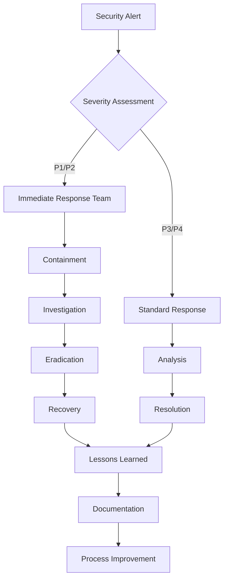

# Security Architecture and Threat Model

## Overview

This document provides a comprehensive security architecture and threat model for the QuantX Platform. It identifies potential security threats, vulnerabilities, and corresponding mitigation strategies to ensure the platform meets the highest security standards for financial applications.

## Security Architecture

### Defense in Depth Strategy

```
┌─────────────────────────────────────────────────────────────┐
│                    External Perimeter                       │
│  ┌─────────────────────────────────────────────────────────┐ │
│  │            Web Application Firewall (WAF)              │ │
│  │  • DDoS Protection  • Bot Detection  • Rate Limiting   │ │
│  └─────────────────────────────────────────────────────────┘ │
└─────────────────────────────────────────────────────────────┘
                            │
                            ▼
┌─────────────────────────────────────────────────────────────┐
│                    Network Security                         │
│  ┌─────────────────────────────────────────────────────────┐ │
│  │                 API Gateway                             │ │
│  │  • TLS Termination  • Authentication  • Authorization  │ │
│  │  • Input Validation  • Request Logging                 │ │
│  └─────────────────────────────────────────────────────────┘ │
└─────────────────────────────────────────────────────────────┘
                            │
                            ▼
┌─────────────────────────────────────────────────────────────┐
│                Application Security                         │
│  ┌─────────────────┐  ┌─────────────────┐  ┌──────────────┐ │
│  │ Authentication  │  │ Authorization   │  │ Data         │ │
│  │ Service         │  │ Service         │  │ Validation   │ │
│  └─────────────────┘  └─────────────────┘  └──────────────┘ │
└─────────────────────────────────────────────────────────────┘
                            │
                            ▼
┌─────────────────────────────────────────────────────────────┐
│                    Data Security                            │
│  ┌─────────────────┐  ┌─────────────────┐  ┌──────────────┐ │
│  │ Encryption at   │  │ Encryption in   │  │ Access       │ │
│  │ Rest            │  │ Transit         │  │ Controls     │ │
│  └─────────────────┘  └─────────────────┘  └──────────────┘ │
└─────────────────────────────────────────────────────────────┘
                            │
                            ▼
┌─────────────────────────────────────────────────────────────┐
│                Infrastructure Security                      │
│  ┌─────────────────┐  ┌─────────────────┐  ┌──────────────┐ │
│  │ Container       │  │ Network         │  │ Host         │ │
│  │ Security        │  │ Segmentation    │  │ Security     │ │
│  └─────────────────┘  └─────────────────┘  └──────────────┘ │
└─────────────────────────────────────────────────────────────┘
```

### Security Domains

#### 1. Identity and Access Management (IAM)

**Authentication Architecture**:
```
┌─────────────┐    ┌─────────────┐    ┌─────────────┐
│   Client    │───▶│ API Gateway │───▶│ Auth Service│
│             │    │             │    │             │
└─────────────┘    └─────────────┘    └─────────────┘
                           │                  │
                           ▼                  ▼
                   ┌─────────────┐    ┌─────────────┐
                   │Session Store│    │ User Store  │
                   │  (Redis)    │    │(PostgreSQL)│
                   └─────────────┘    └─────────────┘
```

**Multi-Factor Authentication (MFA)**:
```json
{
  "mfa_policy": {
    "admin_users": {
      "required": true,
      "methods": ["totp", "sms", "hardware_key"],
      "backup_codes": 10
    },
    "standard_users": {
      "required": false,
      "methods": ["totp", "sms"],
      "opt_in_incentive": "reduced_fees"
    },
    "api_access": {
      "required": true,
      "methods": ["api_key", "jwt_with_mfa"]
    }
  }
}
```

**Role-Based Access Control (RBAC)**:
```json
{
  "roles": {
    "system_admin": {
      "permissions": ["*:*"],
      "mfa_required": true,
      "session_timeout": "15m"
    },
    "compliance_officer": {
      "permissions": [
        "audit:read", "reports:read", "users:read",
        "compliance:*"
      ],
      "mfa_required": true
    },
    "portfolio_manager": {
      "permissions": [
        "portfolio:read", "portfolio:write",
        "trading:execute", "analytics:read"
      ],
      "resource_constraints": {
        "portfolio_access": "owned_or_assigned"
      }
    },
    "trader": {
      "permissions": [
        "portfolio:read", "trading:execute",
        "market:read"
      ],
      "limits": {
        "max_order_value": 1000000,
        "daily_trade_limit": 10000000
      }
    },
    "analyst": {
      "permissions": [
        "portfolio:read", "analytics:*",
        "reports:read", "market:read"
      ]
    },
    "viewer": {
      "permissions": ["portfolio:read", "market:read"],
      "session_timeout": "4h"
    }
  }
}
```

#### 2. Data Protection

**Encryption Strategy**:
```
Data Classification:
├── Public
│   └── Encryption: Optional (TLS in transit)
├── Internal
│   └── Encryption: TLS + AES-128
├── Confidential
│   └── Encryption: TLS + AES-256
└── Restricted (PII, Financial Data)
    └── Encryption: TLS 1.3 + AES-256 + Field-level encryption
```

**Key Management Architecture**:
```
┌─────────────────┐    ┌─────────────────┐    ┌─────────────────┐
│ Application     │───▶│  Key Manager    │───▶│  Hardware HSM   │
│ (Data Encryption│    │   Service       │    │   (Key Storage) │
│  Key Requests)  │    │                 │    │                 │
└─────────────────┘    └─────────────────┘    └─────────────────┘
                              │
                              ▼
                       ┌─────────────────┐
                       │   Key Rotation  │
                       │   Audit Logs    │
                       └─────────────────┘
```

**Database Encryption**:
```sql
-- Transparent Data Encryption (TDE)
ALTER SYSTEM SET transparent_data_encryption = ON;

-- Column-level encryption for sensitive data
CREATE TABLE users (
    id UUID PRIMARY KEY,
    email VARCHAR(255),
    encrypted_ssn BYTEA, -- PGP encrypted
    encrypted_account_number BYTEA -- PGP encrypted
);

-- Row-level security
CREATE POLICY user_data_access ON users
    FOR ALL TO application_role
    USING (user_id = current_setting('app.user_id')::UUID);
```

#### 3. Network Security

**Network Segmentation**:
```
Internet
    │
┌───▼────┐
│  WAF   │
└───┼────┘
    │
┌───▼────────────┐
│ DMZ (Public)   │ ← Web servers, Load balancers
│ 10.1.0.0/24    │
└───┼────────────┘
    │
┌───▼──────────────┐
│ App Tier         │ ← Application servers, API Gateway
│ 10.2.0.0/24      │
└───┼──────────────┘
    │
┌───▼──────────────┐
│ Data Tier        │ ← Databases, Cache servers
│ 10.3.0.0/24      │
└──────────────────┘
```

**Firewall Rules**:
```json
{
  "firewall_rules": {
    "web_tier": {
      "inbound": [
        {"port": 80, "source": "internet", "action": "redirect_to_443"},
        {"port": 443, "source": "internet", "action": "allow"}
      ],
      "outbound": [
        {"port": 8080, "destination": "app_tier", "action": "allow"}
      ]
    },
    "app_tier": {
      "inbound": [
        {"port": 8080, "source": "web_tier", "action": "allow"},
        {"port": 9090, "source": "monitoring", "action": "allow"}
      ],
      "outbound": [
        {"port": 5432, "destination": "data_tier", "action": "allow"},
        {"port": 6379, "destination": "data_tier", "action": "allow"}
      ]
    },
    "data_tier": {
      "inbound": [
        {"port": 5432, "source": "app_tier", "action": "allow"},
        {"port": 6379, "source": "app_tier", "action": "allow"}
      ],
      "outbound": "deny_all"
    }
  }
}
```

## Threat Model Analysis

### Threat Modeling Methodology

**STRIDE Analysis**:
- **Spoofing**: Identity verification threats
- **Tampering**: Data integrity threats  
- **Repudiation**: Non-repudiation threats
- **Information Disclosure**: Confidentiality threats
- **Denial of Service**: Availability threats
- **Elevation of Privilege**: Authorization threats

### High-Risk Threat Scenarios

#### 1. Account Takeover Attacks

**Threat Description**:
Attackers gain unauthorized access to user accounts through credential stuffing, phishing, or social engineering.

**Attack Vectors**:
```
1. Credential Stuffing
   ├── Automated login attempts with stolen credentials
   ├── Bot networks targeting login endpoints  
   └── Bypassing basic rate limiting

2. Phishing Attacks
   ├── Fake login pages mimicking QuantX
   ├── Email phishing campaigns
   └── SMS phishing (Smishing)

3. Social Engineering
   ├── Customer service impersonation
   ├── Password reset manipulation
   └── SIM swapping for SMS 2FA bypass
```

**Risk Assessment**:
- **Likelihood**: High
- **Impact**: Critical
- **Risk Level**: Critical

**Mitigation Strategies**:
```json
{
  "mitigations": {
    "prevention": [
      {
        "control": "Multi-factor authentication",
        "implementation": "TOTP mandatory for high-value accounts",
        "effectiveness": "High"
      },
      {
        "control": "Rate limiting and CAPTCHA",
        "implementation": "Progressive delays, device fingerprinting",
        "effectiveness": "Medium"
      },
      {
        "control": "Behavioral analytics",
        "implementation": "ML-based anomaly detection",
        "effectiveness": "High"
      }
    ],
    "detection": [
      {
        "control": "Login anomaly detection",
        "implementation": "Geolocation, device, time-based analysis",
        "response_time": "< 1 minute"
      },
      {
        "control": "Account activity monitoring",
        "implementation": "Real-time transaction monitoring",
        "response_time": "Real-time"
      }
    ],
    "response": [
      {
        "action": "Account lockout",
        "trigger": "Suspicious login patterns",
        "duration": "Until manual verification"
      },
      {
        "action": "Transaction halt",
        "trigger": "Compromised account detection",
        "duration": "Until security review"
      }
    ]
  }
}
```

#### 2. API Security Threats

**Threat Description**:
Attacks targeting API endpoints to gain unauthorized access or extract sensitive data.

**Attack Vectors**:
```
1. API Abuse
   ├── Excessive API calls (DoS)
   ├── Parameter pollution
   └── GraphQL query depth attacks

2. Injection Attacks
   ├── SQL injection through API parameters
   ├── NoSQL injection in search queries
   └── Command injection in file operations

3. Broken Authentication
   ├── JWT token manipulation
   ├── Session fixation
   └── OAuth implementation flaws
```

**Mitigation Strategies**:
```yaml
api_security_controls:
  input_validation:
    - parameter_whitelisting: true
    - schema_validation: openapi_3.0
    - size_limits:
        request_body: 1MB
        query_params: 100
        headers: 50
  
  rate_limiting:
    global: 1000_per_hour
    per_endpoint:
      "/api/auth/login": 10_per_minute
      "/api/trading/orders": 100_per_minute
      "/api/market/data": 1000_per_minute
  
  authentication:
    jwt_validation:
      - signature_verification: required
      - expiration_check: required
      - audience_validation: required
    
  authorization:
    rbac_enforcement: strict
    resource_level_checks: enabled
    audit_logging: comprehensive
```

#### 3. Data Exfiltration

**Threat Description**:
Unauthorized extraction of sensitive financial and personal data.

**Attack Vectors**:
```
1. Insider Threats
   ├── Privileged user abuse
   ├── Data export by authorized users
   └── Database administrator access

2. External Attacks
   ├── SQL injection leading to data dumps
   ├── API exploitation for bulk data access
   └── Backup file compromise

3. Supply Chain Attacks
   ├── Third-party integration vulnerabilities
   ├── Compromised dependencies
   └── Cloud provider breaches
```

**Data Loss Prevention (DLP)**:
```json
{
  "dlp_policies": {
    "data_classification": {
      "pii": ["ssn", "credit_card", "bank_account"],
      "financial": ["portfolio_value", "trade_data", "account_balance"],
      "confidential": ["api_keys", "passwords", "tokens"]
    },
    "monitoring_rules": [
      {
        "trigger": "large_data_export",
        "threshold": "> 1000 records",
        "action": "alert_and_audit"
      },
      {
        "trigger": "unusual_query_pattern",
        "condition": "SELECT * FROM sensitive_table",
        "action": "block_and_alert"
      },
      {
        "trigger": "off_hours_access",
        "condition": "weekend_or_after_hours",
        "action": "require_additional_approval"
      }
    ],
    "egress_controls": {
      "email_filtering": "enabled",
      "usb_blocking": "enabled",  
      "cloud_upload_monitoring": "enabled",
      "network_egress_filtering": "enabled"
    }
  }
}
```

#### 4. Trading Manipulation

**Threat Description**:
Attempts to manipulate trading systems for financial gain or market disruption.

**Attack Vectors**:
```
1. Order Manipulation
   ├── Spoofing (placing and quickly canceling orders)
   ├── Layering (multiple orders to create false demand)
   └── Quote stuffing (rapid order placement)

2. Price Manipulation
   ├── Pump and dump schemes
   ├── Wash trading (self-trading)
   └── Front-running based on order flow

3. System Exploitation
   ├── Race condition exploitation
   ├── Timing attacks on order execution
   └── Price feed manipulation
```

**Trading Security Controls**:
```json
{
  "trading_controls": {
    "pre_trade_validation": {
      "position_limits": {
        "max_position_size": "5% of portfolio",
        "concentration_limit": "10% per sector",
        "leverage_limit": "2:1"
      },
      "risk_checks": {
        "var_limit": "2% of portfolio value",
        "stop_loss_mandatory": true,
        "market_impact_analysis": "enabled"
      }
    },
    "surveillance": {
      "pattern_detection": [
        "spoofing_detection",
        "layering_detection", 
        "wash_trading_detection"
      ],
      "alerts": {
        "unusual_order_size": "> 10x average",
        "rapid_order_cancellation": "> 50% cancel rate",
        "cross_market_arbitrage": "enabled"
      }
    },
    "post_trade_analysis": {
      "trade_reconstruction": "enabled",
      "best_execution_analysis": "required",
      "regulatory_reporting": "automated"
    }
  }
}
```

#### 5. Infrastructure Attacks

**Threat Description**:
Attacks targeting the underlying infrastructure and cloud services.

**Attack Vectors**:
```
1. Cloud Service Attacks
   ├── Misonfigured S3 buckets
   ├── IAM privilege escalation
   └── Container escape attacks

2. Network Attacks  
   ├── Man-in-the-middle attacks
   ├── DNS hijacking
   └── BGP hijacking

3. Supply Chain Attacks
   ├── Compromised Docker images
   ├── Malicious NPM packages
   └── Signed certificate abuse
```

**Infrastructure Security Measures**:
```yaml
infrastructure_security:
  container_security:
    - base_image_scanning: enabled
    - runtime_protection: enabled  
    - network_policies: strict
    - resource_limits: enforced
    
  cloud_security:
    - cloud_config_compliance: cis_benchmarks
    - iam_least_privilege: enforced
    - network_segmentation: enabled
    - encryption_at_rest: aes_256
    
  supply_chain:
    - dependency_scanning: daily
    - license_compliance: automated
    - artifact_signing: required
    - provenance_tracking: enabled
```

## Security Monitoring and Response

### Security Information and Event Management (SIEM)

**Log Sources**:
```
Application Logs:
├── Authentication events
├── Authorization failures
├── API access logs
├── Trading transactions
├── Error conditions
└── Performance metrics

Infrastructure Logs:
├── System access logs  
├── Network traffic logs
├── Database audit logs
├── Container runtime logs
├── Cloud service logs
└── Load balancer logs

Security Tools:
├── WAF logs
├── IDS/IPS alerts
├── Vulnerability scan results
├── Endpoint detection logs
└── Email security events
```

**Security Analytics**:
```json
{
  "analytics_rules": {
    "authentication_anomalies": {
      "multiple_failed_logins": {
        "threshold": 5,
        "timeframe": "5_minutes",
        "severity": "medium"
      },
      "impossible_travel": {
        "condition": "login_from_different_countries",
        "timeframe": "< 4_hours",
        "severity": "high"
      }
    },
    "data_access_anomalies": {
      "bulk_data_access": {
        "threshold": "> 1000_records",
        "severity": "high"
      },
      "privileged_access_abuse": {
        "condition": "admin_access_off_hours",
        "severity": "critical"
      }
    },
    "trading_anomalies": {
      "unusual_trading_volume": {
        "threshold": "> 10x_average",
        "severity": "medium"
      },
      "rapid_position_changes": {
        "threshold": "> 50_trades_per_minute",
        "severity": "high"
      }
    }
  }
}
```

### Incident Response Framework

**Incident Classification**:
```
Severity Levels:
├── P1 (Critical): System compromise, data breach
│   └── Response Time: 15 minutes
├── P2 (High): Service disruption, failed security controls  
│   └── Response Time: 1 hour
├── P3 (Medium): Policy violations, suspicious activity
│   └── Response Time: 4 hours
└── P4 (Low): Security advisories, minor issues
    └── Response Time: 24 hours
```

**Response Procedures**:


**Containment Strategies**:
```json
{
  "containment_playbooks": {
    "account_compromise": [
      "disable_affected_accounts",
      "revoke_active_sessions",
      "block_suspicious_ip_addresses",
      "halt_trading_activity",
      "preserve_audit_logs"
    ],
    "data_breach": [
      "isolate_affected_systems", 
      "block_data_egress",
      "preserve_evidence",
      "notify_stakeholders",
      "begin_forensic_analysis"
    ],
    "malware_infection": [
      "quarantine_infected_systems",
      "update_antivirus_signatures", 
      "scan_all_systems",
      "check_lateral_movement",
      "rebuild_compromised_systems"
    ]
  }
}
```

## Security Testing and Validation

### Security Testing Program

**Testing Types**:
```
1. Static Application Security Testing (SAST)
   ├── Code vulnerability scanning
   ├── Dependency vulnerability analysis
   └── Configuration security checks

2. Dynamic Application Security Testing (DAST)
   ├── Automated vulnerability scanning
   ├── API security testing
   └── Authentication bypass testing

3. Interactive Application Security Testing (IAST)
   ├── Runtime vulnerability detection
   ├── Code coverage analysis
   └── Performance impact assessment

4. Penetration Testing
   ├── Network penetration testing
   ├── Web application penetration testing
   ├── Social engineering testing
   └── Physical security testing
```

**Security Testing Schedule**:
```yaml
testing_schedule:
  continuous:
    - sast_scanning: "every_commit"
    - dependency_scanning: "daily"
    - configuration_checks: "deployment"
    
  regular:
    - dast_scanning: "weekly"
    - penetration_testing: "quarterly"
    - red_team_exercise: "annually"
    
  compliance:
    - soc2_audit: "annually"
    - vulnerability_assessment: "quarterly"
    - security_training: "annually"
```

### Compliance and Governance

**Regulatory Compliance**:
```
Financial Regulations:
├── SOX (Sarbanes-Oxley Act)
│   └── Financial reporting controls
├── GDPR (General Data Protection Regulation)  
│   └── Data privacy and protection
├── PCI DSS (Payment Card Industry)
│   └── Payment processing security
├── SOC 2 Type II
│   └── Security and availability controls
└── ISO 27001
    └── Information security management
```

**Security Policies**:
```json
{
  "security_policies": {
    "password_policy": {
      "min_length": 12,
      "complexity": "required",
      "history": 12,
      "expiration": "90_days_admin"
    },
    "access_control_policy": {
      "principle": "least_privilege",
      "review_frequency": "quarterly",
      "provisioning": "automated",
      "deprovisioning": "immediate"
    },
    "data_classification_policy": {
      "levels": ["public", "internal", "confidential", "restricted"],
      "handling_requirements": "per_classification",
      "retention_periods": "defined_per_type"
    },
    "incident_response_policy": {
      "response_team": "24x7_coverage",
      "escalation_procedures": "defined",
      "communication_plan": "stakeholder_specific"
    }
  }
}
```

This comprehensive security architecture and threat model provides the foundation for protecting the QuantX Platform against evolving security threats while maintaining regulatory compliance and user trust.