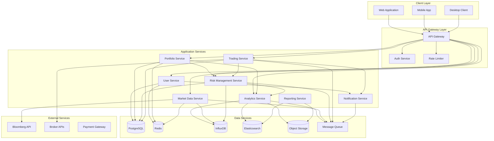

# Service Topology and Interactions

## Overview

This document describes the detailed service topology, communication patterns, and interaction flows within the QuantX Platform ecosystem. It provides a comprehensive view of how services collaborate to deliver quantitative analysis capabilities.

## Service Map

### Core Services



## Service Details

### API Gateway Service

**Purpose**: Central entry point for all client requests

**Responsibilities**:
- Request routing and load balancing
- Authentication and authorization
- Rate limiting and throttling
- Request/response transformation
- API versioning management
- SSL termination

**Technology Stack**:
- NGINX or Kong Gateway
- JWT token validation
- Redis for rate limiting
- Prometheus metrics

**Endpoints**:
```
GET  /health              - Health check
POST /auth/login          - Authentication
GET  /api/v1/*           - Route to services
```

**Dependencies**:
- Auth Service (authentication)
- All application services (routing)
- Redis (rate limiting, session storage)

### User Management Service

**Purpose**: Handle user lifecycle and profile management

**Responsibilities**:
- User registration and authentication
- Profile management
- Permission and role management
- Session handling
- Password policy enforcement

**Technology Stack**:
- Node.js with Express
- PostgreSQL for user data
- Redis for session storage
- bcrypt for password hashing

**Key APIs**:
```
POST /users              - Create user
GET  /users/{id}         - Get user profile
PUT  /users/{id}         - Update profile
POST /auth/login         - User authentication
POST /auth/logout        - Session termination
GET  /users/{id}/permissions - Get user permissions
```

**Data Model**:
```sql
users (
    id UUID PRIMARY KEY,
    email VARCHAR UNIQUE NOT NULL,
    password_hash VARCHAR NOT NULL,
    first_name VARCHAR,
    last_name VARCHAR,
    role VARCHAR NOT NULL,
    created_at TIMESTAMP,
    updated_at TIMESTAMP,
    last_login TIMESTAMP
);
```

**Dependencies**:
- PostgreSQL (user data)
- Redis (sessions)
- Notification Service (email verification)

### Market Data Service

**Purpose**: Aggregate and distribute real-time market data

**Responsibilities**:
- Market data ingestion from multiple sources
- Data normalization and cleansing
- Real-time streaming to subscribers
- Historical data storage and retrieval
- Market event processing

**Technology Stack**:
- Node.js with WebSocket support
- InfluxDB for time series data
- Redis for real-time caching
- Kafka for event streaming

**Key APIs**:
```
GET  /market/instruments     - List available instruments
GET  /market/quotes/{symbol} - Real-time quote
GET  /market/history/{symbol} - Historical data
WS   /market/stream          - Real-time streaming
POST /market/alerts          - Price alerts
```

**Data Sources**:
- Bloomberg Terminal API
- Reuters Market Data
- Alpha Vantage API
- Yahoo Finance API
- Broker data feeds

**Data Flow**:
```
External APIs → Data Ingestion → Normalization → InfluxDB
                                     ↓
Redis Cache ← Real-time Stream ← Event Processing
     ↓
WebSocket → Client Applications
```

**Dependencies**:
- InfluxDB (time series storage)
- Redis (caching, pub/sub)
- External market data providers

### Portfolio Management Service

**Purpose**: Manage user portfolios and holdings

**Responsibilities**:
- Portfolio creation and management
- Holdings tracking and valuation
- Performance calculation
- Asset allocation analysis
- Rebalancing recommendations

**Technology Stack**:
- Node.js with Express
- PostgreSQL for portfolio data
- Redis for caching
- Integration with Analytics Service

**Key APIs**:
```
POST /portfolios                    - Create portfolio
GET  /portfolios/{id}               - Get portfolio details
PUT  /portfolios/{id}               - Update portfolio
GET  /portfolios/{id}/holdings      - List holdings
POST /portfolios/{id}/transactions  - Add transaction
GET  /portfolios/{id}/performance   - Performance metrics
GET  /portfolios/{id}/allocation    - Asset allocation
```

**Data Model**:
```sql
portfolios (
    id UUID PRIMARY KEY,
    user_id UUID REFERENCES users(id),
    name VARCHAR NOT NULL,
    description TEXT,
    created_at TIMESTAMP
);

holdings (
    id UUID PRIMARY KEY,
    portfolio_id UUID REFERENCES portfolios(id),
    symbol VARCHAR NOT NULL,
    quantity DECIMAL,
    average_cost DECIMAL,
    updated_at TIMESTAMP
);

transactions (
    id UUID PRIMARY KEY,
    portfolio_id UUID REFERENCES portfolios(id),
    symbol VARCHAR NOT NULL,
    type VARCHAR, -- BUY, SELL, DIVIDEND
    quantity DECIMAL,
    price DECIMAL,
    timestamp TIMESTAMP
);
```

**Dependencies**:
- PostgreSQL (portfolio data)
- Market Data Service (pricing)
- Analytics Service (calculations)
- Risk Management Service (risk metrics)

### Analytics Service

**Purpose**: Perform quantitative analysis and calculations

**Responsibilities**:
- Financial metrics calculation
- Risk analytics
- Performance attribution
- Statistical analysis
- Backtesting framework
- Custom indicator development

**Technology Stack**:
- Node.js with computational libraries
- Python integration for advanced analytics
- InfluxDB for historical analysis
- Elasticsearch for complex queries

**Key APIs**:
```
GET  /analytics/performance/{portfolioId} - Performance metrics
GET  /analytics/risk/{portfolioId}        - Risk analysis
POST /analytics/backtest                  - Backtest strategy
GET  /analytics/correlations              - Asset correlations
POST /analytics/optimize                  - Portfolio optimization
GET  /analytics/metrics/{symbol}          - Technical indicators
```

**Calculation Engines**:
- **Performance Engine**: Returns, volatility, Sharpe ratio
- **Risk Engine**: VaR, CVaR, beta, drawdown analysis
- **Optimization Engine**: Modern portfolio theory, Black-Litterman
- **Backtesting Engine**: Strategy simulation and validation

**Dependencies**:
- InfluxDB (historical data)
- Market Data Service (current prices)
- PostgreSQL (portfolio data)
- External calculation libraries

### Risk Management Service

**Purpose**: Monitor and assess portfolio risks

**Responsibilities**:
- Real-time risk monitoring
- Position size validation
- Exposure limits enforcement
- Risk metric calculations
- Alert generation
- Compliance checking

**Technology Stack**:
- Node.js with real-time processing
- PostgreSQL for risk rules
- Redis for real-time caching
- Message queue for alerts

**Key APIs**:
```
GET  /risk/exposure/{portfolioId}    - Current exposures
GET  /risk/limits/{portfolioId}      - Risk limits
POST /risk/validate                  - Pre-trade validation
GET  /risk/var/{portfolioId}         - Value at Risk
GET  /risk/stress/{portfolioId}      - Stress test results
POST /risk/alerts                    - Risk alert configuration
```

**Risk Models**:
- **Market Risk**: VaR, scenario analysis, stress testing
- **Credit Risk**: Counterparty exposure, rating analysis
- **Liquidity Risk**: Market depth, bid-ask spreads
- **Operational Risk**: System availability, data quality

**Dependencies**:
- Analytics Service (risk calculations)
- Market Data Service (current data)
- Portfolio Service (holdings data)
- Notification Service (alerts)

### Trading Service

**Purpose**: Execute trades and manage orders

**Responsibilities**:
- Order management and routing
- Trade execution monitoring
- Broker integration
- Order history and reporting
- Settlement tracking

**Technology Stack**:
- Node.js with low-latency requirements
- PostgreSQL for order data
- Direct broker API integrations
- Real-time messaging

**Key APIs**:
```
POST /trading/orders              - Place order
GET  /trading/orders/{id}         - Order status
PUT  /trading/orders/{id}/cancel  - Cancel order
GET  /trading/executions          - Trade executions
GET  /trading/positions           - Current positions
```

**Broker Integrations**:
- Interactive Brokers TWS API
- TD Ameritrade API
- Alpaca Markets API
- Custom FIX protocol adapters

**Order Management**:
```
Order Placement → Risk Validation → Broker Routing → Execution → Settlement
      ↓               ↓                 ↓              ↓           ↓
   Portfolio     Risk Service    Trading Service   Execution   Notification
   Service                                         Monitoring    Service
```

**Dependencies**:
- Risk Management Service (pre-trade checks)
- Portfolio Service (position updates)
- Broker APIs (order execution)
- Notification Service (execution alerts)

### Notification Service

**Purpose**: Handle all system notifications and communications

**Responsibilities**:
- Email notifications
- SMS alerts
- Push notifications
- In-app messaging
- Notification preferences management

**Technology Stack**:
- Node.js with email/SMS libraries
- Message queues for async processing
- Redis for notification state
- Integration with external providers

**Key APIs**:
```
POST /notifications/email     - Send email
POST /notifications/sms       - Send SMS
POST /notifications/push      - Push notification
GET  /notifications/history   - Notification history
PUT  /notifications/preferences - Update preferences
```

**Notification Types**:
- **Trade Confirmations**: Order fills and executions
- **Risk Alerts**: Limit breaches and warnings
- **Market Alerts**: Price movements and news
- **System Notifications**: Maintenance and updates

**Dependencies**:
- Message Queue (async processing)
- Redis (state management)
- External providers (SendGrid, Twilio)

## Communication Patterns

### Synchronous Communication

**HTTP/REST APIs**:
- Client-to-service communication
- Service-to-service for immediate responses
- Request-response pattern with timeout handling

**GraphQL Federation**:
- Unified API layer for complex queries
- Cross-service data aggregation
- Type-safe schema stitching

### Asynchronous Communication

**Event-Driven Architecture**:
- Domain events for service decoupling
- Event sourcing for audit trails
- CQRS pattern for read/write separation

**Message Queue Patterns**:
```
Publisher → Message Queue → Subscriber
    ↓           ↓              ↓
Market Data → Kafka Topic → Portfolio Updates
Risk Events → RabbitMQ → Notification Service
Trade Events → SQS → Analytics Processing
```

### Data Flow Patterns

**Real-time Streaming**:
```
Market Data Sources → WebSocket Server → Client Applications
                  ↓
              InfluxDB Storage
```

**Batch Processing**:
```
Daily EOD Data → Batch Processor → Analytics Updates → Report Generation
```

**Cache-Aside Pattern**:
```
Application → Check Redis Cache → If Miss → Database → Update Cache
```

## Service Interactions

### User Authentication Flow

```
1. Client → API Gateway: Login request
2. API Gateway → Auth Service: Validate credentials
3. Auth Service → PostgreSQL: User lookup
4. Auth Service → Redis: Store session
5. Auth Service → API Gateway: JWT token
6. API Gateway → Client: Authentication response
```

### Market Data Flow

```
1. External API → Market Data Service: Price updates
2. Market Data Service → InfluxDB: Store historical data
3. Market Data Service → Redis: Cache current prices
4. Market Data Service → Message Queue: Publish events
5. Portfolio Service ← Message Queue: Price updates
6. Portfolio Service → WebSocket: Real-time updates to clients
```

### Trade Execution Flow

```
1. Client → API Gateway: Place order
2. API Gateway → Trading Service: Order request
3. Trading Service → Risk Service: Pre-trade validation
4. Risk Service → Portfolio Service: Check holdings/limits
5. Trading Service → Broker API: Submit order
6. Broker API → Trading Service: Execution confirmation
7. Trading Service → Portfolio Service: Update positions
8. Trading Service → Notification Service: Send confirmation
9. Trading Service → Client: Order status
```

## Service Dependencies

### Dependency Matrix

| Service | PostgreSQL | Redis | InfluxDB | Elasticsearch | Message Queue | External APIs |
|---------|------------|--------|----------|---------------|---------------|---------------|
| User Management | ✓ | ✓ | - | - | - | - |
| Market Data | - | ✓ | ✓ | - | ✓ | ✓ |
| Portfolio | ✓ | ✓ | - | - | ✓ | - |
| Analytics | - | ✓ | ✓ | ✓ | ✓ | - |
| Risk Management | ✓ | ✓ | ✓ | - | ✓ | - |
| Trading | ✓ | ✓ | - | - | ✓ | ✓ |
| Notification | - | ✓ | - | - | ✓ | ✓ |

### Critical Path Analysis

**High Priority Dependencies**:
1. API Gateway → All Services (single point of failure)
2. Market Data Service → Real-time operations
3. PostgreSQL → Data consistency
4. Redis → Performance and caching

**Failure Recovery**:
- Circuit breakers for external API calls
- Database read replicas for high availability
- Message queue durability for event persistence
- Graceful degradation for non-critical features

This topology documentation provides the foundation for understanding service interactions, planning deployments, and troubleshooting issues within the QuantX Platform ecosystem.