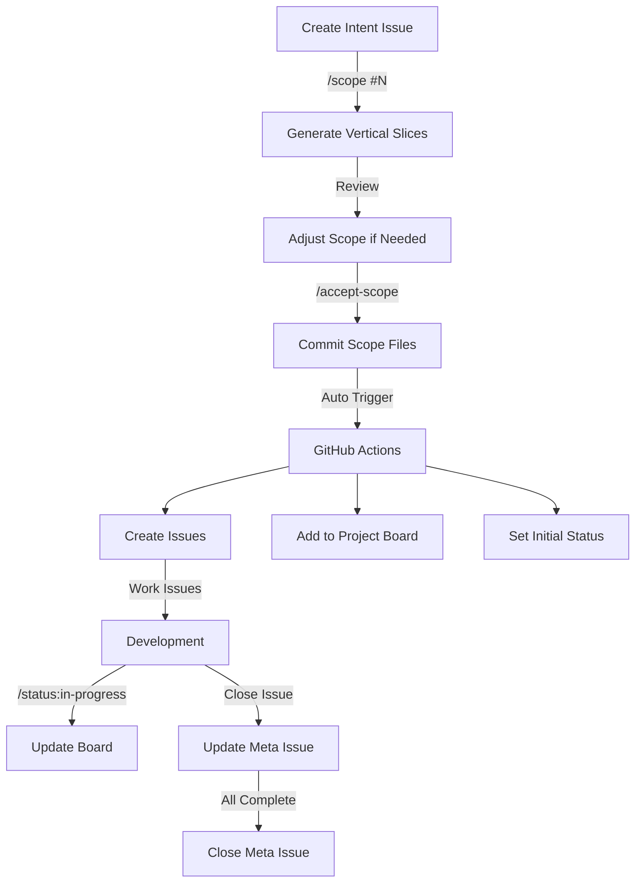

# PM Automation Guide

Complete guide to the automated project management workflow in Solo Software Factory.

## 🚀 Quick Start

### 1. Initial Setup

```bash
# Clone the template
git clone https://github.com/yourusername/solo-software-factory.git
cd solo-software-factory

# Create a GitHub Personal Access Token
# Go to: https://github.com/settings/tokens/new
# Scopes needed: repo, project
# Add as secret: PROJECT_TOKEN

# Run setup workflow to create project board
gh workflow run setup-project.yml
```

### 2. Create Your First Feature

```bash
# Create an intent issue
gh issue create --title "User Authentication" --body "Need login/logout functionality"

# Generate scope (replace #1 with your issue number)
/scope #1

# Review and accept
/accept-scope

# Watch the magic happen! 🎉
```

## 📋 Complete Workflow



## 🤖 Automation Features

### 1. Intent → Scope Generation

The PM agent analyzes your intent and creates:
- **Vertical slices**: Complete features (DB → API → UI)
- **Acceptance criteria**: Testable requirements
- **Agent recommendations**: Which agents to use and when
- **Estimates**: Story points (S=3, M=5, L=8, XL=13)
- **Risk assessment**: Low/Medium/High
- **Dependencies**: Order of implementation

### 2. Scope → Issues

When you run `/accept-scope`:
1. Scope files are committed to `.claude/out/`
2. GitHub Actions triggered via issue comment
3. Creates individual issues for each slice
4. Creates meta tracking issue
5. Adds all issues to project board
6. Sets initial status to "Todo"
7. Closes original intent issue

### 3. Project Board Integration

Full GitHub Projects v2 GraphQL integration:
- **Automatic field creation**: Status, Priority, Risk, Points, Sprint
- **Real-time sync**: Issues ↔ Project Board
- **Status tracking**: Via labels and project fields
- **Meta issue updates**: Checkboxes track slice completion

### 4. Status Management

Multiple ways to update status:

#### Comment Commands
```bash
/status:todo          # Move to backlog
/status:in-progress   # Start work
/status:review        # Ready for review
/status:blocked       # Blocked by dependency
/status:done          # Complete
```

#### Automatic Updates
- Issue opened → `status:todo`
- PR opened → `status:review`
- PR merged → `status:done`
- Issue closed → `status:done`

#### Label Sync
- Status labels automatically sync with project board
- Duplicate status labels are cleaned up
- Meta issues update when slices complete

## 🔧 Configuration

### Required Secrets

| Secret | Purpose | How to Create |
|--------|---------|---------------|
| `PROJECT_TOKEN` | Full project automation | [Create PAT](https://github.com/settings/tokens/new) with `repo` + `project` scopes |
| `ANTHROPIC_API_KEY` | Claude Code agents | Get from [Anthropic Console](https://console.anthropic.com/) |

### Optional Variables

| Variable | Purpose | Default |
|----------|---------|---------|
| `PROJECT_NUMBER` | Target project board | Auto-detected |
| `DEFAULT_SPRINT` | Initial sprint for issues | Backlog |

## 📝 Commands Reference

### Claude Code Commands

| Command | Description | Example |
|---------|-------------|---------|
| `/scope` | Generate vertical slices from intent | `/scope #1` |
| `/review-agents` | Review/edit agent allocations | `/review-agents` |
| `/accept-scope` | Accept scope and create issues | `/accept-scope` |
| `/issues` | List current issues and status | `/issues` |
| `/issue` | Select issue to work on | `/issue #5` |

### GitHub Comment Commands

| Command | Description | Trigger |
|---------|-------------|---------|
| `/accept-scope` | Trigger issue creation | On intent issue |
| `/status:*` | Update issue status | On any issue |

## 🎯 Project Board Fields

### Default Fields Created

| Field | Type | Options/Values |
|-------|------|----------------|
| **Status** | Single Select | Todo, In Progress, In Review, Blocked, Done |
| **Priority** | Single Select | High, Medium, Low |
| **Risk** | Single Select | Low, Medium, High |
| **Component** | Single Select | Frontend, Backend, Database, Infrastructure, Documentation |
| **Points** | Number | 3, 5, 8, 13 (from estimates) |
| **Sprint** | Single Select | Backlog, Sprint 1-4 |

## 🔄 Workflows

### GitHub Actions Workflows

| Workflow | Trigger | Purpose |
|----------|---------|---------|
| `setup-project.yml` | Manual | Create and configure project board |
| `issue-comment-trigger.yml` | Issue comments | Handle `/accept-scope` and `/status:*` |
| `scope-to-issues.yml` | Workflow dispatch | Create issues from scope.json |
| `project-board-automation.yml` | Issue/PR events | Sync with project board |

## 🚨 Troubleshooting

### Issues Not Added to Project

**Problem**: Issues created but not on board

**Solutions**:
1. Check `PROJECT_TOKEN` is set correctly
2. Verify token has `project` scope
3. Run `setup-project.yml` to create board
4. Check Actions logs for errors

### /accept-scope Not Working

**Problem**: Comment posted but nothing happens

**Solutions**:
1. Ensure `.claude/out/` is not in `.gitignore`
2. Check workflow permissions in repository settings
3. Verify `issue-comment-trigger.yml` exists
4. Check Actions tab for workflow runs

### Status Not Syncing

**Problem**: Labels and board out of sync

**Solutions**:
1. Check `PROJECT_TOKEN` has correct permissions
2. Verify project fields exist (Status, etc.)
3. Manual sync: Close and reopen issue
4. Check for duplicate status labels

### GraphQL Errors

**Problem**: "Project not found" or GraphQL failures

**Solutions**:
1. Token needs `read:project` and `write:project` scopes
2. For org repos, token owner needs project access
3. Try creating project manually first
4. Check if Projects are enabled for repository

## 📊 Monitoring Progress

### Dashboard Views

1. **Project Board**: Visual kanban view
2. **Meta Issues**: Overall scope progress
3. **Issue Labels**: Quick status filtering
4. **Actions Tab**: Automation history

### Metrics to Track

- **Velocity**: Points completed per sprint
- **Cycle Time**: Todo → Done duration
- **Blocked Time**: How long in blocked status
- **Completion Rate**: Slices done / total

## 🎨 Customization

### Adding Custom Fields

Edit `.github/workflows/setup-project.yml`:

```javascript
// Add new single-select field
await createSingleSelectField(project.id, 'Team', [
  'Frontend Team',
  'Backend Team',
  'DevOps Team'
]);

// Add new number field
await createNumberField(project.id, 'Hours Estimated');
```

### Custom Status Flow

Modify status options in:
1. `setup-project.yml` - Field creation
2. `project-board-automation.yml` - Status mapping
3. `issue-comment-trigger.yml` - Comment commands

### Agent Recommendations

Update `.claude/agents/pm.md` to customize:
- Slicing patterns
- Agent allocation rules
- Estimate mappings
- Risk assessments

## 🔐 Security Considerations

1. **Token Security**:
   - Never commit tokens to repository
   - Use repository secrets only
   - Rotate tokens regularly
   - Limit token scopes to minimum needed

2. **Workflow Permissions**:
   - Use `permissions:` to limit workflow access
   - Require approval for external contributors
   - Review workflow changes carefully

3. **Comment Commands**:
   - Check `author_association` before processing
   - Limit to repository members
   - Add rate limiting if needed

## 📚 Advanced Usage

### Bulk Operations

```bash
# Close all completed slices
gh issue list --label "vertical-slice" --label "status:done" --json number \
  | jq -r '.[].number' | xargs -I {} gh issue close {}

# Move all blocked issues to review
gh issue list --label "status:blocked" --json number \
  | jq -r '.[].number' | while read num; do
    gh issue comment $num --body "/status:review"
  done
```

### Custom Integrations

The GraphQL scripts in `.github/scripts/project-graphql.js` can be extended for:
- Slack notifications
- Time tracking
- Burndown charts
- Custom reporting

### API Access

Use the ProjectV2Manager class in your own scripts:

```javascript
const ProjectV2Manager = require('./.github/scripts/project-graphql.js');
const manager = new ProjectV2Manager(process.env.PROJECT_TOKEN);

// Get all project items
const items = await manager.getProjectItems(projectId);

// Update multiple fields
await manager.updateNumberField(projectId, itemId, pointsFieldId, 8);
await manager.updateSingleSelectField(projectId, itemId, statusFieldId, doneOptionId);
```

## 🎯 Best Practices

1. **Keep Intents Focused**: One feature area per intent
2. **Review Slices Carefully**: Ensure they're truly vertical
3. **Update Status Regularly**: Keep board current
4. **Close Completed Work**: Triggers automation
5. **Use Meta Issues**: Track overall progress
6. **Commit Scope Files**: Enables full automation
7. **Monitor Actions**: Check for failures
8. **Document Decisions**: In issue comments

## 🚦 Getting Started Checklist

- [ ] Create PROJECT_TOKEN with correct scopes
- [ ] Add token to repository secrets
- [ ] Run setup-project workflow
- [ ] Create first intent issue
- [ ] Generate scope with `/scope`
- [ ] Review agent recommendations
- [ ] Accept scope with `/accept-scope`
- [ ] Verify issues created on board
- [ ] Start working with `/status:in-progress`
- [ ] Celebrate automation success! 🎉

---

For more details, see:
- [Spec Process Guide](SPEC_PROCESS.md)
- [Claude Code Memory](../CLAUDE.md)
- [Setup Guide](../SETUP.md)