# portfolio x ray 🚀

Build production apps 10x faster with AI-powered development. This template adapts to any project type while maintaining quality and enabling parallel development.

## Quick Start

### Phase 1: Initial Setup (One-time only)
```bash
# Clone and setup your project
git clone [template-url] my-app
cd my-app
./setup-new-project.sh

# During setup, you'll:
# 1. Name your project
# 2. Choose architecture:
#    - Full-Stack Web App (API + UI)
#    - API Service Only
#    - Data Pipeline
#    - Static Website
#    - Custom (define later in Claude)
# 3. Auto-installs ONLY what you need
```

### Phase 2: Development (Repeatable workflow)
```bash
# 1. Start Claude Code
claude

# 2. Define what you want to build
/spec-to-stories "Your app idea"
/spec-score  # Must be ≥ 7.0 before proceeding

# 3. Plan your work
/parallel-strategy  # Find what can be built in parallel
/stories-to-github  # Create GitHub issues

# 4. NOW start development server
make dev  # Runs only what your architecture needs

# 5. Build features
/test-plan US-001
/gen-tests US-001
/story-ui US-001 --step 1
# ... continue development
```

## 🏗️ Architecture-First Development

The template adapts to YOUR project needs:

```bash
# Option 1: Use preset during setup
./setup-new-project.sh  # Choose from menu

# Option 2: Use adaptive installer directly
./adaptive-install.sh --preset full-stack

# Option 3: Define custom architecture in Claude
/define-architecture
```

This determines:
- What dependencies get installed
- Which services run with `make dev`
- What project structure is created
- Which tests are relevant

## Core Workflow

```mermaid
graph LR
    A[Define Architecture] --> B[Write Spec]
    B --> C[Check Quality ≥7.0]
    C --> D[Generate Stories]
    D --> E[Find Parallel Work]
    E --> F[Build with Agents]
    F --> G[Ship to GitHub]
```



## Essential Commands (15 total)

| Command | Purpose | Example |
|---------|---------|---------|
| `/define-architecture` | Define project architecture | `/define-architecture` |
| `/spec-score` | Check specification quality | `/spec-score` |
| `/user-story` | Create single story | `/user-story "As a user..."` |
| `/spec-to-stories` | Generate multiple stories | `/spec-to-stories "app idea"` |
| `/story-ui` | Build UI in 4 steps | `/story-ui US-001 --step 1` |
| `/gen-tests` | Auto-generate tests | `/gen-tests US-001` |
| `/test-plan` | Create test plan | `/test-plan US-001` |
| `/test-fixit` | Fix failing tests | `/test-fixit` |
| `/parallel-strategy` | Find parallel work | `/parallel-strategy` |
| `/spawn-expert` | Create domain expert | `/spawn-expert quant` |
| `/issue` | Work on GitHub issue | `/issue #5` |
| `/issues` | List GitHub issues | `/issues` |
| `/stories-to-github` | Sync stories to GitHub | `/stories-to-github` |
| `/db-setup` | Connect to database | `/db-setup` |
| `/spec-enhance` | Improve specifications | `/spec-enhance` |

## AI Agents (7 core + domain experts)

| Agent | Responsibility | When to Use |
|-------|---------------|-------------|
| **pm** | Stories & parallel work | Planning features |
| **architect** | System design | Technical decisions |
| **backend** | API development | Building endpoints |
| **frontend** | UI development | Creating interfaces |
| **dba** | Database design | Schema & queries |
| **qa** | Testing & quality | Test planning & generation |
| **security** | Code review | Security checks |
| **[domain]** | Domain expertise | Spawn as needed with `/spawn-expert`|

## Testing as First-Class Citizen

### Test-Driven Workflow
```bash
# 1. Create test plan from story
/test-plan US-001

# 2. Generate tests BEFORE implementation
/gen-tests US-001

# 3. Implement features (tests will fail initially)
/backend implement auth endpoints

# 4. Fix failing tests
/test-fixit

# 5. All tests pass = feature complete
```

### Testing Pyramid
- **Unit Tests** (70%): Fast, isolated, many
- **Integration** (20%): API & database tests
- **E2E** (10%): Critical user journeys only

## Parallel Development

The template automatically identifies work that can be done in parallel:

```bash
/parallel-strategy

# Output:
Track 1: Backend API (can start immediately)
  - US-001: User authentication
  - US-002: Data models

Track 2: Frontend UI (can start after API contract)
  - US-003: Login form
  - US-004: Dashboard

Track 3: Testing (can start with Track 1)
  - Unit tests for auth
  - Integration tests for API
  
Track 4: Infrastructure (can start immediately)
  - Database setup
  - CI/CD pipeline
```

## GitHub Integration

Stories automatically sync with GitHub:
- Issues created from user stories
- Project board tracks progress
- Pull requests linked to issues
- Automated status updates

## Adaptive Architecture

The template adapts completely to your project:

### Architecture Presets
- **Full-Stack**: Next.js + FastAPI + PostgreSQL + Redis
- **API-Only**: FastAPI + PostgreSQL (no frontend)
- **Data Pipeline**: Airflow + Pandas + PostgreSQL
- **Static Site**: Next.js only (no backend)
- **Custom**: Define your exact stack in Claude

### What Gets Adapted
✅ **Dependencies**: Only installs what you need  
✅ **Project Structure**: Creates relevant directories  
✅ **Docker Services**: Runs only required services  
✅ **Makefile**: Commands match your architecture  
✅ **Tests**: Appropriate test setup for your stack  
✅ **Environment**: .env configured for your services  

### Architecture Definition File
```yaml
# .claude/architecture.yml (auto-generated)
project:
  type: "full-stack"
stack:
  backend: 
    framework: "fastapi"
    packages: [fastapi, sqlalchemy, ...]
  frontend:
    framework: "nextjs"
    packages: [react, tailwind, ...]
  database:
    primary: "postgresql"
    cache: "redis"
```

## Domain Experts On-Demand

Spawn specialized experts based on your project:

```bash
# Detect and suggest experts
/spawn-expert              # Auto-suggests based on spec

# Create specific expert
/spawn-expert quant        # Finance/trading expert
/spawn-expert payments     # Payment processing expert
/spawn-expert privacy      # GDPR/privacy expert
/spawn-expert ml          # Machine learning expert
/spawn-expert healthcare   # HIPAA/medical expert

# Use spawned expert
@quant Review my risk calculations
@payments Implement PCI compliance
```

Available domains: finance, healthcare, ecommerce, blockchain, ML/AI, privacy, compliance, and more.

## Memory & Context Management

### Smart Context Loading
- Loads only relevant files for current task
- Automatically summarizes at 70% capacity
- Preserves important decisions

### Persistent Memory
- **Decisions**: Architecture choices in `.claude/DECISIONS.md`
- **Patterns**: Learned from your code in `.claude/PATTERNS.md`
- **State**: Current progress in `.claude/STATE.md`

## Project Structure

Adapts to your needs:
```
my-app/
├── .claude/           # AI configuration
│   ├── agents/        # 6 specialized agents
│   ├── commands/      # 11 essential commands
│   ├── config.yml     # Simple configuration
│   └── *.md          # Memory files
├── apps/             # Created as needed
├── user-stories/     # Your requirements
└── README.md         # This file
```

## Quality Gates

✅ **Specification Score**: Must be ≥ 7.0  
✅ **Incremental UI**: Build in 4 testable steps  
✅ **Parallel Work**: Always identify opportunities  
✅ **GitHub Sync**: Stories become trackable issues  
✅ **Security Scan**: Pre-commit secret detection  

## Best Practices

### ✅ DO
- Start with clear specs
- Check quality before building
- Identify parallel work
- Test incrementally
- Commit with story IDs

### ❌ DON'T
- Skip quality checks
- Build without specs
- Work sequentially when parallel is possible
- Commit secrets
- Over-engineer

## Example: Building a Feature

```bash
# 1. Define what you want
/user-story "As a user, I want to create tasks"

# 2. Check quality
/spec-score  # Must be ≥ 7.0

# 3. Create test plan
/test-plan US-001

# 4. Find parallel opportunities
/parallel-strategy

# 5. Build incrementally with tests
/gen-tests US-001          # Generate tests first
/story-ui US-001 --step 1  # Raw data
/backend Create task API
/story-ui US-001 --step 2  # Basic UI
/frontend Build task form
/story-ui US-001 --step 3  # Structure
/story-ui US-001 --step 4  # Polish
/test-fixit                # Fix any failing tests

# 6. Ship it
git add .
git commit -m "feat: Create tasks (US-001)"
/stories-to-github  # Sync with GitHub
```

## Installation Requirements

- Python 3.9-3.13+
- Node.js 18+
- PostgreSQL 14+ (optional)
- Docker (optional)

```bash
# Check compatibility
./check-python.sh

# Install dependencies (handles all Python versions)
./install.sh

# Or use Docker
docker-compose up
```

## Troubleshooting

| Issue | Solution |
|-------|----------|
| Python dependency errors | Run `./install.sh` (auto-detects version) |
| Port already in use | Change in `.env` file |
| Quality score too low | Run `/spec-enhance` |
| Can't find parallel work | Check `/parallel-strategy` output |

## Getting Help

- In Claude: Type `/help`
- Check memory: `.claude/PATTERNS.md` for learned solutions
- Review decisions: `.claude/DECISIONS.md`

## Success Metrics

After using this template:
- ✅ 10x faster development
- ✅ Consistent quality (≥7.0)
- ✅ Parallel development enabled
- ✅ GitHub integration working
- ✅ Clean, maintainable code

---

**Ready to build?** Start with `/spec-to-stories "your idea"` and watch the magic happen! 🎯

*Note: This template is continuously improved based on patterns learned from your usage.*