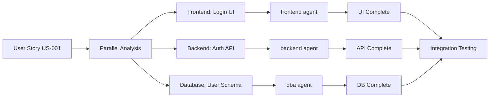
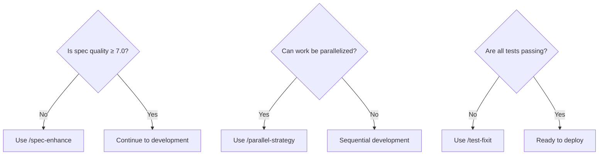

# Solo Soft Factory - Complete Workflow Diagram

## From Template Installation to Feature Deployment

```mermaid
flowchart TD
    Start([Start: Template Installation]) --> Init[Initialize Project]
    
    Init --> Arch{Architecture<br/>Defined?}
    Arch -->|No| DefArch[/define-architecture<br/>Define project structure]
    Arch -->|Yes| Stories
    DefArch --> Stories
    
    Stories[Create User Stories] --> Score{Quality<br/>Score ≥ 7.0?}
    Score -->|No| Enhance[/spec-enhance<br/>Improve specification]
    Enhance --> Score
    Score -->|Yes| Parallel
    
    Parallel[/parallel-strategy<br/>Identify parallel work] --> Split{Can work be<br/>parallelized?}
    Split -->|Yes| ParallelDev[Spawn multiple agents<br/>for parallel development]
    Split -->|No| Sequential[Sequential development]
    
    ParallelDev --> UIBuild
    Sequential --> UIBuild
    
    UIBuild[/story-ui<br/>Build UI in 4 steps] --> UISteps
    
    subgraph UISteps[Incremental UI Development]
        UI1[Step 1: Structure<br/>Layout & containers]
        UI2[Step 2: Components<br/>Core functionality]
        UI3[Step 3: Interactive<br/>Event handlers]
        UI4[Step 4: Polish<br/>Styling & UX]
        UI1 --> Test1[Test Step 1]
        Test1 --> UI2
        UI2 --> Test2[Test Step 2]
        Test2 --> UI3
        UI3 --> Test3[Test Step 3]
        Test3 --> UI4
        UI4 --> Test4[Test Step 4]
    end
    
    UISteps --> Tests[/gen-tests<br/>Generate comprehensive tests]
    Tests --> TestRun{All tests<br/>passing?}
    TestRun -->|No| FixTests[/test-fixit<br/>Fix failing tests]
    FixTests --> TestRun
    TestRun -->|Yes| Commit
    
    Commit[Git commit with<br/>story reference] --> GitHub{Push to<br/>GitHub?}
    GitHub -->|Yes| CreatePR[Create Pull Request<br/>with gh CLI]
    GitHub -->|No| Local[Continue locally]
    
    CreatePR --> Review{Code<br/>Review}
    Review -->|Changes needed| Fix[Make requested changes]
    Fix --> TestRun
    Review -->|Approved| Merge
    
    Local --> NextFeature
    Merge[Merge to main] --> Deploy
    
    Deploy[Deploy to production] --> Monitor[Monitor & iterate]
    Monitor --> NextFeature{More<br/>features?}
    NextFeature -->|Yes| Stories
    NextFeature -->|No| End([Project Complete])
    
    style Start fill:#e1f5e1
    style End fill:#ffe1e1
    style DefArch fill:#fff3cd
    style Enhance fill:#fff3cd
    style ParallelDev fill:#d4edda
    style UISteps fill:#f8f9fa
    style Deploy fill:#cff4fc
    style Monitor fill:#f1aeb5
```

## Key Workflow Stages

### 1️⃣ **Setup & Architecture** (Day 1)
- Install template: `npx @solo-soft/factory init`
- Define architecture with `/define-architecture`
- System adapts to your tech stack

### 2️⃣ **Requirements & Planning** (Days 1-2)
- Create user stories with `/user-story`
- Check quality scores with `/spec-score`
- Enhance specs if score < 7.0
- Identify parallel work opportunities

### 3️⃣ **Development** (Days 2-5)
- Build UI incrementally (4 steps)
- Test at each step
- Use parallel agents for independent features
- Generate comprehensive tests

### 4️⃣ **Quality Assurance** (Continuous)
- Run tests after each change
- Fix failures with `/test-fixit`
- Security scans via pre-commit hooks

### 5️⃣ **Deployment** (Day 5+)
- Commit with story references
- Create PR with `gh` CLI
- Code review process
- Merge and deploy

## Parallel Development Example



## Decision Points



## Time Estimates

| Phase | Duration | Commands Used |
|-------|----------|--------------|
| Setup | 30 min | `/define-architecture` |
| User Stories | 1-2 hours | `/user-story`, `/spec-score` |
| Development | 2-3 days | `/story-ui`, `/parallel-strategy` |
| Testing | 4-6 hours | `/gen-tests`, `/test-fixit` |
| Deployment | 1-2 hours | `gh pr create` |

## Success Metrics

- ✅ All specs score ≥ 7.0
- ✅ 100% test coverage for critical paths
- ✅ No security vulnerabilities
- ✅ Parallel work identified and executed
- ✅ Clean git history with story references